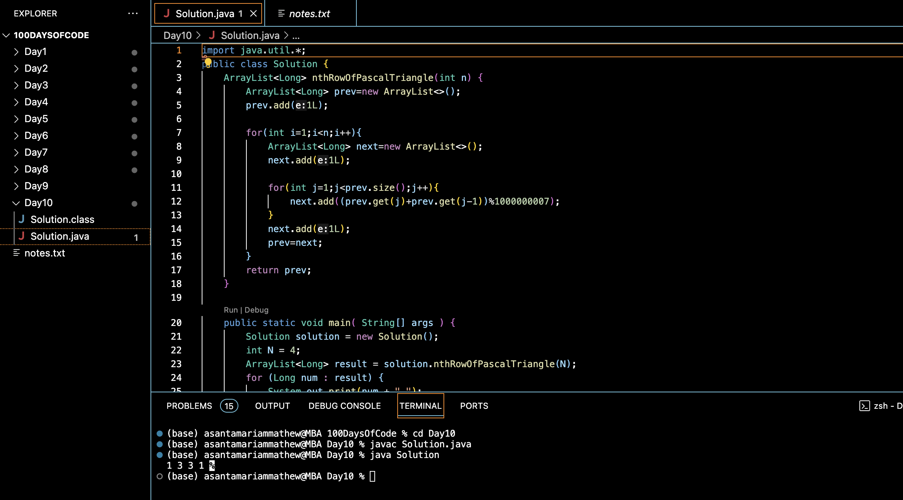

# PASCAL TRIANGLE :blush:
## DAY :one: :zero: -November 24, 2023

## Code Overview
This Java code calculates the nth row of Pascal's Triangle and returns it as an ArrayList. It also includes a main method to demonstrate the calculation of the nth row and the output.

## Key Features
**Pascal's Triangle Calculation**: The nthRowOfPascalTriangle method calculates the nth row of Pascal's Triangle using dynamic programming principles.

**ArrayList Usage**: ArrayLists are used to store the elements of each row of Pascal's Triangle.

**Modular Arithmetic**: Modular arithmetic with a large modulus (1000000007) is employed to prevent overflow while computing large numbers.

## Code Breakdown
**nthRowOfPascalTriangle Method**:

-Initializes the first row of Pascal's Triangle with a single element 1L.

-Iterates from the second row up to the nth row, computing each row based on the previous row.

-Utilizes modular arithmetic to prevent integer overflow.

-Returns the nth row of Pascal's Triangle as an ArrayList.

**Main Method**:

-Instantiates the Solution class.

-Calls the nthRowOfPascalTriangle method with the desired value of n (in this case, n = 4).

-Prints the resulting ArrayList representing the nth row of Pascal's Triangle.

## Usage
1. Instantiate the Solution class.
2. Call the nthRowOfPascalTriangle method with the desired value of n.
3. Use the resulting ArrayList to access the nth row of Pascal's Triangle.

## Output

## Link
<https://auth.geeksforgeeks.org/user/asantamarptz2>