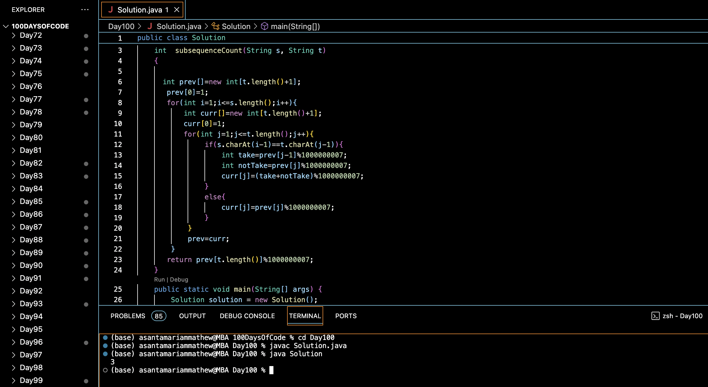

# DISTINCT OCCURENCES :blush:
## DAY :one: :zero: :zero: -February 22, 2024

## Code Overview
This Java program calculates the number of subsequences of string `s` that match string `t`. It utilizes dynamic programming to efficiently count the occurrences of the subsequence `t` in the string `s`.

## Key Features
- Efficiently counts the number of subsequences of string `s` that match string `t`.
- Utilizes dynamic programming with a 2D array to store intermediate results.
- Handles strings of varying lengths and characters.
- Modifies the intermediate results to avoid overflow by taking the modulo operation.

## Code Breakdown
The program consists of:
1. **`subsequenceCount` Method**: Calculates the number of subsequences of string `s` that match string `t`.
    - Initializes an array `prev` to store the previous row of the dynamic programming table.
    - Iterates through each character of string `s` and string `t`.
    - Updates the current row of the dynamic programming table based on whether the characters match.
    - Modifies the intermediate results to avoid overflow by taking the modulo operation.
    - Returns the number of subsequences of string `s` that match string `t`.

2. **`main` Method**: The main entry point of the program.
    - Initializes the strings `s` and `t`.
    - Calls the `subsequenceCount` method to compute the number of subsequences and prints the result.

## Usage
To use this program:
1. Compile the Java file using a Java compiler.
2. Run the compiled program.
3. The program will output the number of subsequences of string `s` that match string `t`.

## Output

## Link
<https://auth.geeksforgeeks.org/user/asantamarptz2>

