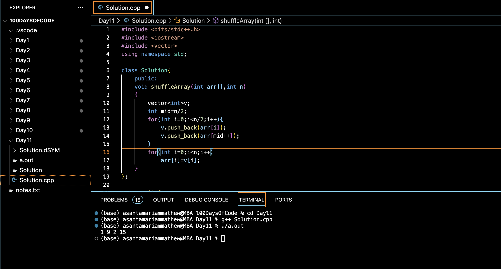

# SHUFFLE INTEGERS :blush:
## DAY :one: :one: -November 25, 2023

## Code Overview
This code implements a function to shuffle an array by interleaving its first half with the second half. It utilizes a class `Solution` with a method `shuffleArray` to perform the shuffling. The `main` function demonstrates the usage of this method by shuffling a sample array.

## Key Features
**Shuffle Array Method**: The `shuffleArray` method shuffles the input array by interleaving its first half with the second half.

**Simple Usage**: The usage of the `shuffleArray` method is demonstrated in the `main` function with a sample array.

## Code Breakdown
**Solution Class**: Defines a class named `Solution` which contains the `shuffleArray` method.

**shuffleArray Method**: This method takes an array `arr` and its size `n` as parameters, shuffles the array by interleaving its first half with the second half, and modifies the original array in-place.

**Main Function**: Initializes an array with sample values, creates an instance of the `Solution` class, calls the `shuffleArray` method, and prints the shuffled array.

## Usage
1. Include the necessary header files: `<iostream>` and `<vector>`.
2. Define an instance of the `Solution` class.
3. Call the `shuffleArray` method with the array and its size as arguments.
4. Access the shuffled array.

## Output

## Link
<https://auth.geeksforgeeks.org/user/asantamarptz2>