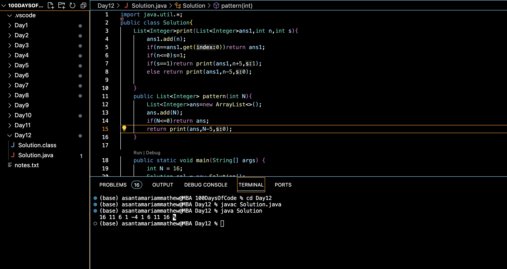

# PRINT PATTERN :blush:
## DAY :one: :two: -November 26, 2023

## Code Overview
This code generates a pattern of integers based on a given starting value `N`. It utilizes a recursive method `print` to generate the pattern and a `pattern` method to initiate the generation process. The `main` method demonstrates the usage of the `pattern` method and prints the resulting pattern.

## Key Features
**Pattern Generation Method**: The `pattern` method takes a starting integer `N` and generates a pattern of integers based on certain conditions.

**Recursive Approach**: The `print` method recursively generates the pattern based on the conditions specified in the problem statement.

**Simple Usage**: The usage of the `pattern` method is demonstrated in the `main` method by providing a starting value `N` and printing the resulting pattern.

## Code Breakdown
**`print` Method**: Recursively generates the pattern by adding integers to a list based on certain conditions. It takes three parameters: `ans1` (the list containing the pattern), `n` (the current integer), and `s` (a flag indicating the direction of the pattern).

**`pattern` Method**: Initiates the pattern generation process by creating an empty list, adding the starting integer to it, and calling the `print` method to generate the pattern recursively.

**`main` Method**: Initializes a starting value `N`, creates an instance of the `Solution` class, calls the `pattern` method to generate the pattern, and prints the resulting pattern.

## Usage
1. Instantiate the `Solution` class.
2. Call the `pattern` method with the desired starting value `N`.
3. Access the generated pattern from the returned list.

## Output

## Link
<https://auth.geeksforgeeks.org/user/asantamarptz2>