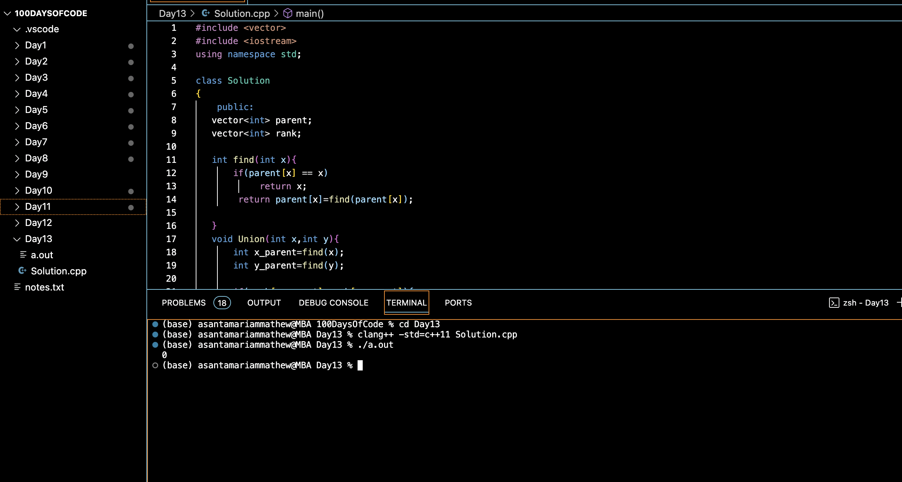

# DETECT CYCLE USING DSU :blush:
## DAY :one: :three: -November 27, 2023

## Code Overview
This code implements a cycle detection algorithm for an undirected graph represented using an adjacency list. It utilizes a class `Solution` with methods to find the parent of a vertex, perform union operations, and detect cycles in the graph. The `main` function demonstrates the usage of these methods by creating a graph and detecting cycles within it.

## Key Features
**Union-Find Algorithm**: The code employs a union-find (disjoint set union) algorithm to efficiently detect cycles in the graph.

**Adjacency List Representation**: The graph is represented using an adjacency list, making it efficient for sparse graphs.

 **Simple Usage**: The usage of the cycle detection algorithm is demonstrated in the `main` function by creating a graph, detecting cycles, and printing the result.

## Code Breakdown
**Solution Class**: Defines a class named `Solution` which contains methods for finding parents, performing unions, and detecting cycles.

**find Method**: Finds the parent of a vertex using path compression to optimize future searches.

**Union Method**: Performs a union operation of two sets based on their ranks to maintain balance in the disjoint sets.

**detectCycle Method**: Detects cycles in the graph using the union-find algorithm.

**Main Function**: Initializes a graph represented as an adjacency list, creates an instance of the `Solution` class, calls the `detectCycle` method to detect cycles in the graph, and prints the result.

## Usage
1. Initialize the number of vertices `V`.
2. Create an adjacency list representing the graph.
3. Instantiate the `Solution` class.
4. Call the `detectCycle` method with the number of vertices and the adjacency list as arguments.
5. Check the returned boolean value to determine if a cycle exists.

## Output

## Link
<https://auth.geeksforgeeks.org/user/asantamarptz2>