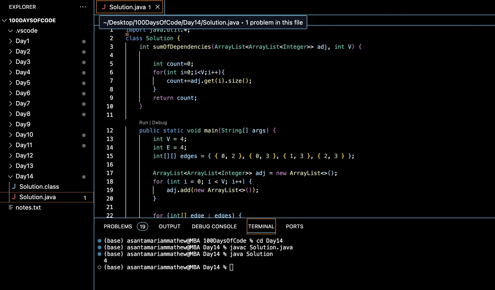

# INTERSECTION OF TWO SORTED LINKED LISTS:blush:
## DAY :one: :four: -November 28, 2023

## Code Overview
This Java code calculates the sum of dependencies in a directed graph represented as an adjacency list.

## Key Features
**Calculates** the sum of dependencies in a directed graph.

**Accepts** input in the form of vertices, edges, and edge connections.

**Utilizes** an adjacency list to represent the graph.

## Code Breakdown
**`sumOfDependencies`**: This method takes an adjacency list `adj` and the number of vertices `V` as input and returns the sum of dependencies.

**`main`**: This method serves as the entry point of the program. It initializes the graph based on the given number of vertices and edges and then calculates the sum of dependencies using the `sumOfDependencies` method.

## Usage
1. Compile the Java file.
2. Run the compiled class file.
3. The program will prompt for the number of vertices `V`, the number of edges `E`, and the edges themselves.
4. After providing the required input, the program will output the sum of dependencies in the graph.

## Output

## Link
<https://auth.geeksforgeeks.org/user/asantamarptz2>