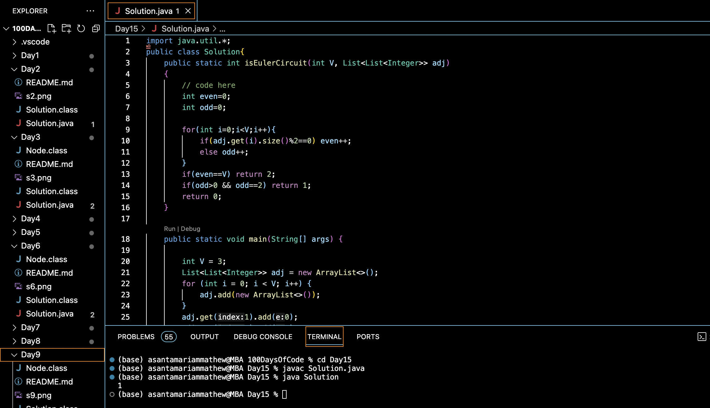

# EULER CIRCUIT AND PATH :blush:
## DAY :one: :five: -November 29, 2023

## Code Overview
This Java program determines whether a graph contains an Euler circuit. An Euler circuit is a circuit that visits every edge of a graph exactly once and returns to the starting vertex. The program implements a solution to detect Euler circuits in a given graph represented using an adjacency list.

## Key Features
- Efficiently detects Euler circuits in a graph using the degree of vertices.
- Utilizes a list of lists to represent the adjacency list of the graph.
- Handles both even and odd degree vertices in the graph.

## Code Breakdown
The program consists of:
1. **`isEulerCircuit` Method**: Determines whether the given graph contains an Euler circuit.
    - Iterates through each vertex of the graph.
    - Counts the number of vertices with even and odd degrees.
    - Returns:
        - `2` if all vertices have even degrees, indicating the presence of an Euler circuit.
        - `1` if there are exactly two vertices with odd degrees, indicating the presence of an Euler path.
        - `0` if neither of the above conditions is met, indicating the absence of an Euler circuit or path.

2. **`main` Method**: The main entry point of the program.
    - Initializes a graph represented as a list of lists containing the adjacency list.
    - Calls the `isEulerCircuit` method to determine whether the graph contains an Euler circuit.
    - Prints the result indicating the presence of an Euler circuit (2), an Euler path (1), or neither (0).

## Usage
To use this program:
1. Compile the Java file using a Java compiler.
2. Run the compiled program.
3. The program will output the result indicating the presence of an Euler circuit, an Euler path, or neither in the given graph.

## Output

## Link
<https://auth.geeksforgeeks.org/user/asantamarptz2>