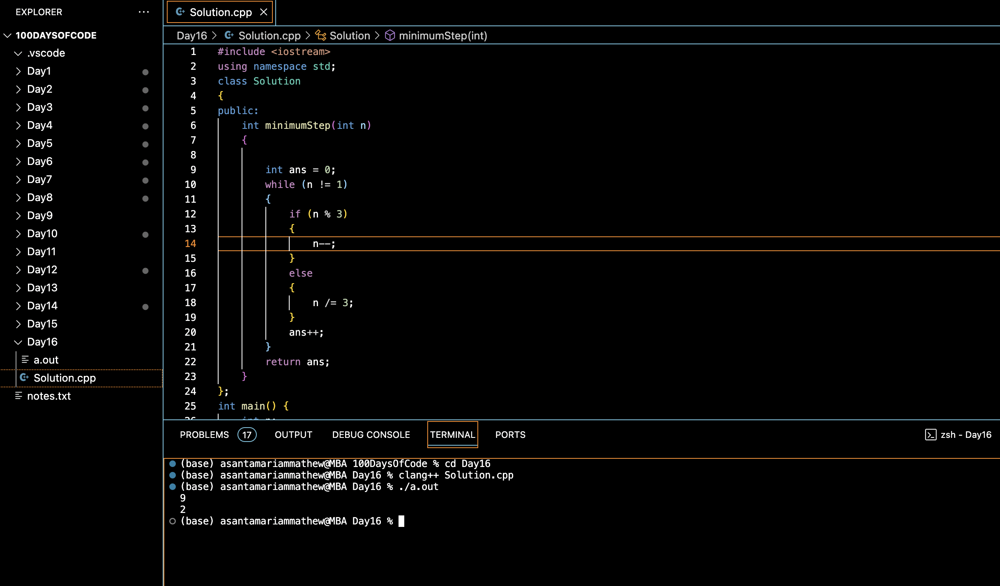

# SHORTEST PATH FROM 1 TO N :blush:
## DAY :one: :six: -November 30, 2023

## Code Overview
This C++ program calculates the minimum steps required to reduce a given number `n` to 1. The program implements a solution using a greedy algorithm.

## Key Features
- Simple implementation.
- Uses a while loop and conditional statements for efficient calculation.
- Utilizes object-oriented programming principles with a class `Solution`.

## Code Breakdown
The program starts with an include directive to include the iostream library for input/output operations.
- A class `Solution` is defined to encapsulate the logic for calculating the minimum steps.
- Inside the class, there's a member function `minimumStep` which takes an integer `n` as input and returns an integer representing the minimum steps required to reduce `n` to 1.
- The `main` function initializes an integer variable `n` and reads input from the user.
- An object of class `Solution` is created, and the `minimumStep` function is called to calculate the result.
- The result is then printed to the standard output.

## Usage
1. Compile the code using a C++ compiler. For example, using clang++:
2. Run the compiled executable with an integer input:
3. Enter a number when prompted.
4. The program will output the minimum steps required to reduce the input number to 1.

## Output

## Link
<https://auth.geeksforgeeks.org/user/asantamarptz2>