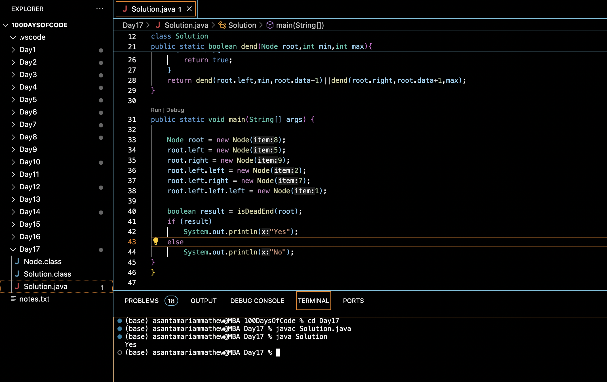

# CHECK WHETHER BST CONTAINS DEAD END :blush:
## DAY :one: :seven: -December 1, 2023

## Code Overview
This Java program checks whether a binary tree contains a dead end or not. A dead end in a binary tree is a node which has only one child or a leaf node with value 1.

## Key Features
- Determines if a binary tree has a dead end.
- Uses recursion to traverse the binary tree.
- Implements a static method `isDeadEnd` to initiate the dead end check.
- Implements a recursive helper method `dend` to perform the actual dead end detection.
- Uses a class `Node` to represent each node in the binary tree.

## Code Breakdown
- The program defines a class `Node` which represents a node in a binary tree. Each node contains an integer value `data` and references to its left and right child nodes.
- A class `Solution` is defined, containing two static methods: `isDeadEnd` and `dend`.
- The `isDeadEnd` method takes the root of the binary tree as input and returns a boolean indicating whether the tree contains a dead end.
- The `dend` method is a helper method that recursively checks for dead ends within the binary tree. It takes the current node, minimum, and maximum values as input parameters and returns true if a dead end is found within the given range.
- The `main` method creates a sample binary tree and invokes the `isDeadEnd` method to check for dead ends. It then prints "Yes" if a dead end is found and "No" otherwise.

## Usage
1. Compile the Java code using a Java compiler.
2. Run the compiled bytecode using the Java Virtual Machine (JVM)
3. The program will output "Yes" if the binary tree contains a dead end, otherwise it will output "No".

## Output

## Link
<https://auth.geeksforgeeks.org/user/asantamarptz2>

