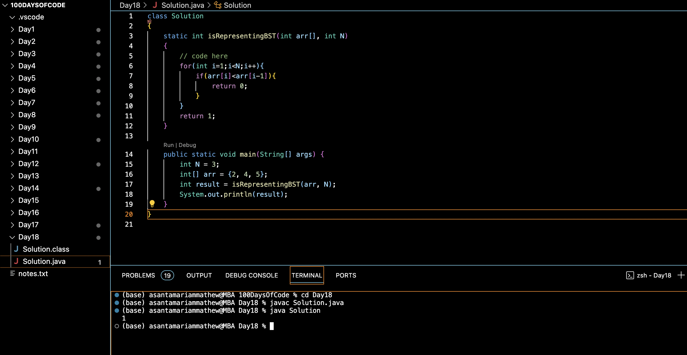

# INORDER TRAVERSAL AND BST :blush:
## DAY :one: :eight: -December 2, 2023

## Code Overview
This Java program checks whether a given array represents a binary search tree (BST). It does so by iterating through the array and checking if each element is greater than or equal to the previous element. If any element is smaller than the previous one, the array does not represent a BST.

## Key Features
- Determines if a given array represents a binary search tree (BST).
- Implements a static method `isRepresentingBST` to perform the checking.
- Uses a simple linear scan to check the ordering of elements in the array.

## Code Breakdown
- The program defines a class `Solution`.
- Inside the class, a static method `isRepresentingBST` is implemented. It takes an integer array `arr` and an integer `N` as input parameters.
- The method iterates through the array starting from the second element. For each element, it compares it with the previous element. If any element is smaller than the previous one, it returns 0 indicating that the array does not represent a BST. If the iteration completes without finding such an element, it returns 1 indicating that the array represents a BST.
- The `main` method creates a sample array `arr` and invokes the `isRepresentingBST` method to check if it represents a BST. It then prints the result to the standard output.

## Usage
1. Compile the Java code using a Java compiler.
2. Run the compiled bytecode using the Java Virtual Machine (JVM).
3. The program will output "1" if the given array represents a binary search tree (BST), otherwise it will output "0".

## Output

## Link
<https://auth.geeksforgeeks.org/user/asantamarptz2>