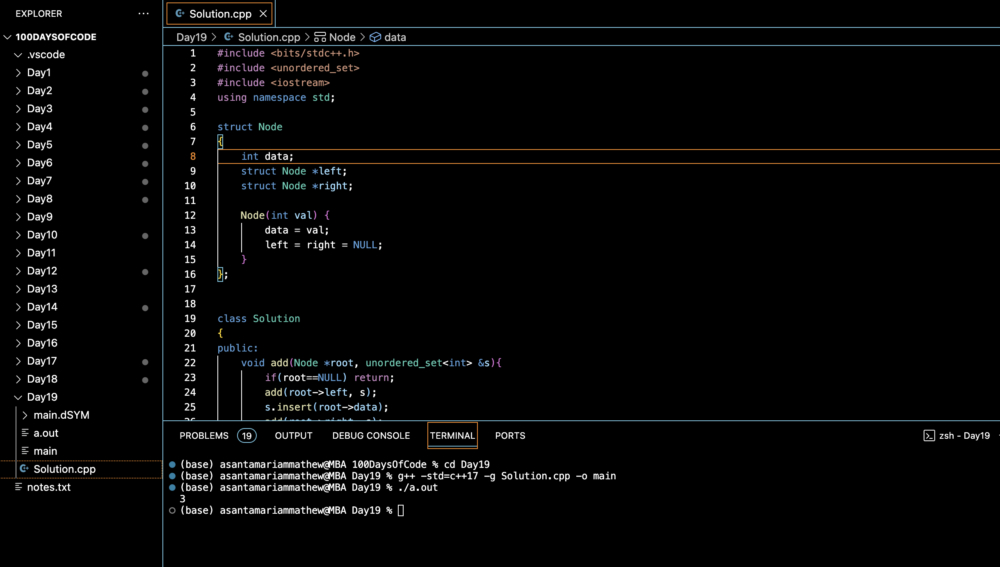

# BROTHERS FROM DIFFERENT ROOTS :blush:
## DAY :one: :nine: -December 3, 2023

## Code Overview
This C++ code demonstrates the implementation of a solution to count pairs of nodes, one from each of two Binary Search Trees (BSTs), whose sum equals a given value.

## Key Features
- Constructs two Binary Search Trees (BST1 and BST2) with predefined values.
- Defines a function to count pairs of nodes from two BSTs whose sum equals a given value.
- Utilizes an unordered set to efficiently store node values of the BSTs.
- Outputs the count of pairs satisfying the condition.

## Code Breakdown
- **Node Structure**: Defines a structure for a node in the BST.
- **Solution Class**: Implements methods to add nodes to an unordered set and count pairs of nodes with a specified sum.
- **Main Function**: Constructs BST1 and BST2, defines the value of 'x', creates an instance of the Solution class, calls the countPairs method, and deallocates dynamically allocated memory.

## Usage
1. Copy the code provided into a C++ compiler or editor.
2. Compile and run the code.
3. Adjust BST values or the target sum ('x') as needed for different test cases.
4. Observe the output which represents the count of pairs satisfying the given condition.

## Output

## Link
<https://auth.geeksforgeeks.org/user/asantamarptz2>