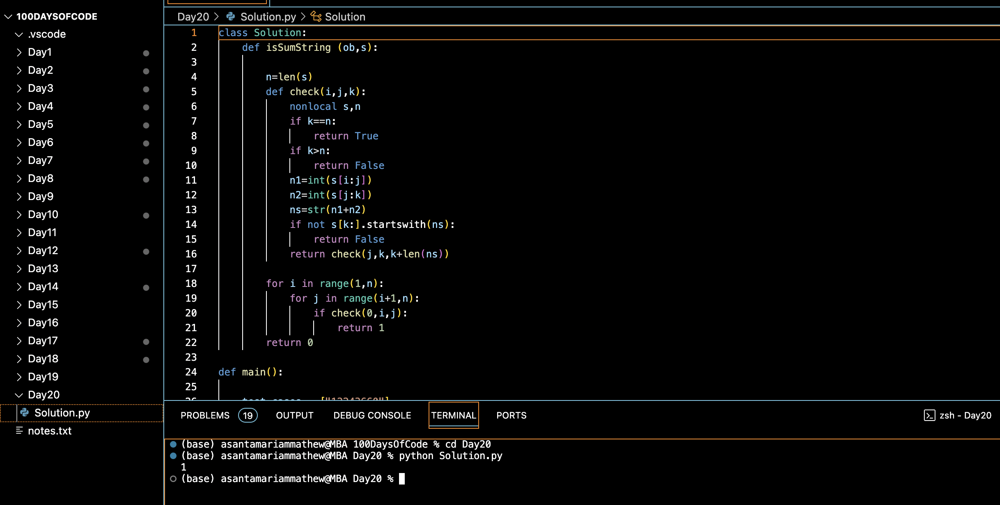

# SUM STRING :blush:
## DAY :two: :zero: -December 4, 2023

## Code Overview
This Python code implements a solution to determine whether a given string is a sum string or not. A sum string is a string where the digits can be partitioned into two or more non-empty substrings such that each substring represents a number, and the sum of those numbers equals the remaining substring.

## Key Features
- Utilizes a recursive approach to check whether a string is a sum string.
- Provides a `check` function to recursively verify if a partitioned string is a sum string.
- Implements a `main` function to define test cases, apply the solution, and print the results.

## Code Breakdown
- **Solution Class**: Defines a class named `Solution` containing a method `isSumString` to determine if a given string is a sum string.
  - The `isSumString` method utilizes a recursive helper function `check` to verify whether the given string is a sum string or not.
- **Main Function**: Defines a `main` function to specify test cases, create an instance of the `Solution` class, and apply the `isSumString` method to each test case.
  - Test cases are defined within the `main` function, and the results are printed to the console.

## Usage
1. Copy the provided Python code into a Python environment or editor.
2. Modify the `test_cases` list within the `main` function to include the strings you want to test.
3. Run the code.
4. The program will output `1` if the input string is a sum string and `0` otherwise.
5. Review the printed results to determine the sum string status of each test case.

## Output

## Link
<https://auth.geeksforgeeks.org/user/asantamarptz2>
