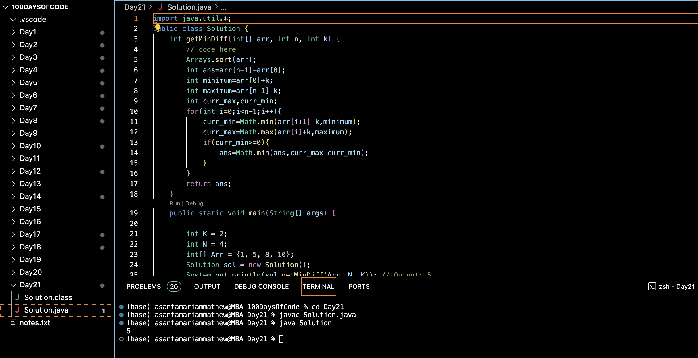

# MINIMIZE THE HEIGHTS II :blush:
## DAY :two: :one: -December 5, 2023

## Code Overview
This Java code provides a solution to find the minimum difference between the heights of the tallest and shortest towers after modifying the heights within a given limit 'k'. The heights of the towers are represented by an array, and the difference is calculated based on the modified heights.

## Key Features
- Utilizes sorting to simplify the problem-solving process by arranging the tower heights in ascending order.
- Implements a loop to iterate through the sorted array and calculate the minimum and maximum possible heights after modification.
- Determines the minimum difference between the modified heights of the tallest and shortest towers.

## Code Breakdown
- **Solution Class**: Defines a class named `Solution` containing a method `getMinDiff` to find the minimum height difference after modifying the tower heights.
  - The `getMinDiff` method sorts the array of tower heights, iterates through the sorted array, and calculates the minimum and maximum possible heights after modification.
- **Main Method**: Defines a `main` method to specify input parameters `K`, `N`, and `Arr`, create an instance of the `Solution` class, call the `getMinDiff` method, and print the result.

## Usage
1. Copy the provided Java code into a Java development environment or editor.
2. Adjust the values of `K`, `N`, and `Arr` within the `main` method to specify different test cases.
3. Run the code.
4. The program will output the minimum difference between the heights of the tallest and shortest towers after modification.
5. Review the printed result to determine the minimum height difference for the specified test case.

## Output

## Link
<https://auth.geeksforgeeks.org/user/asantamarptz2>