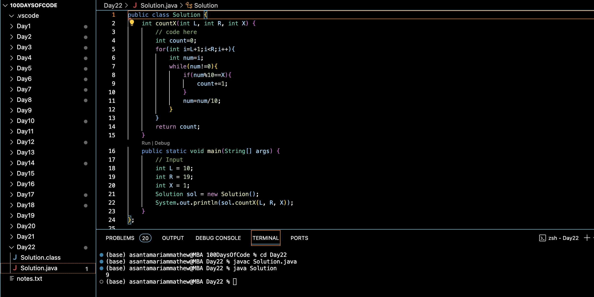

# HOW MANY X's? :blush:
## DAY :two: :two: -December 6, 2023

## Code Overview
This Java code defines a class named `Solution` containing methods to count the occurrences of a digit `X` within a range of integers `[L, R)`.

## Key Features
- **countX Method**: Implements the `countX` method to count the occurrences of a given digit `X` within the range `[L, R)`. It iterates through each integer in the range and checks each digit to determine if it matches the specified digit `X`.
- **Main Method**: Defines a `main` method to specify input parameters `L`, `R`, and `X`, create an instance of the `Solution` class, call the `countX` method, and print the result.
- **Modular Design**: The `countX` method is designed to be modular, allowing it to be easily integrated into other Java programs for counting occurrences of a specific digit within a range of integers.

## Code Breakdown
- **Solution Class**: Defines a class named `Solution`.
  - **countX Method**: Implements the `countX` method to count the occurrences of a given digit within a range of integers.
- **Main Method**: Defines a `main` method to handle input and output.
  - Specifies input parameters `L`, `R`, and `X`.
  - Creates an instance of the `Solution` class.
  - Calls the `countX` method with the specified parameters.
  - Prints the result.

## Usage
1. Copy the provided Java code into a Java development environment or editor.
2. Modify the values of `L`, `R`, and `X` within the `main` method to specify different test cases.
3. Run the code.
4. The program will output the count of occurrences of the specified digit within the given range.
5. Review the printed result to determine the count of occurrences for the specified test case.

## Output

## Link
<https://auth.geeksforgeeks.org/user/asantamarptz2>

