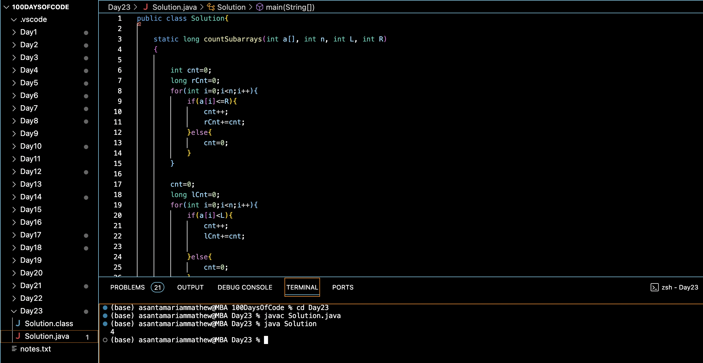

# NUMBER OF SUBARRAYS WITH MAXIMUM VALUES IN GIVEN RANGE :blush:
## DAY :two: :three: -December 7, 2023

## Code Overview
This Java code defines a class named `Solution` containing a static method `countSubarrays` to count the number of subarrays within a given array `a[]` where each element lies in the range `[L, R]`. It then demonstrates the usage of this method in the `main` function.

## Key Features
- **countSubarrays Method**: Implements the `countSubarrays` method to count the number of subarrays where each element lies within the given range `[L, R]`. It utilizes two counters `rCnt` and `lCnt` to track the count of subarrays satisfying the condition.
- **Main Method**: Defines a `main` method to specify input parameters `Arr`, `L`, and `R`, call the `countSubarrays` method, and print the result.
- **Efficient Solution**: The code utilizes a single loop to calculate the count of subarrays within the range `[L, R]`, thereby achieving efficiency in terms of time complexity.

## Code Breakdown
- **Solution Class**: Defines a class named `Solution`.
  - **countSubarrays Method**: Implements the static method `countSubarrays` to count the number of subarrays within the given range `[L, R]`.
- **Main Method**: Defines a `main` method to handle input and output.
  - Specifies input parameters `Arr`, `L`, and `R`.
  - Calls the `countSubarrays` method with the specified parameters.
  - Prints the result.

## Usage
1. Copy the provided Java code into a Java development environment or editor.
2. Modify the values of `Arr`, `L`, and `R` within the `main` method to specify different test cases.
3. Run the code.
4. The program will output the count of subarrays where each element lies within the given range `[L, R]`.
5. Review the printed result to determine the count of subarrays satisfying the specified condition.

## Output

## Link
<https://auth.geeksforgeeks.org/user/asantamarptz2>