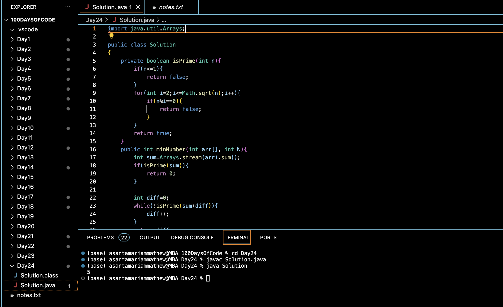

# TRANSFORM TO PRIME :blush:
## DAY :two: :four: -December 8, 2023

## Code Overview

This Java code is designed to find the minimum number required to make the sum of elements in an array a prime number.

## Key Features

- Checks if a given number is prime.
- Calculates the sum of elements in an array.
- Finds the minimum number required to make the sum of array elements a prime number.

## Code Breakdown

The `Solution` class contains two methods:

- `isPrime(int n)`: Determines if a given number is prime. It iterates from 2 to the square root of the number, checking for divisibility.
- `minNumber(int arr[], int N)`: Calculates the sum of elements in the array. If the sum is prime, it returns 0. Otherwise, it iteratively adds numbers to the sum until it becomes prime, returning the minimum number required.

The `main` method demonstrates the usage of the `minNumber` method with a sample array and prints the result.

## Usage

To use this code, follow these steps:
1. Copy the code into your Java environment.
2. Make necessary imports if required.
3. Create an instance of the `Solution` class.
4. Call the `minNumber` method with the array and its size as parameters.
5. The method will return the minimum number required to make the sum of array elements a prime number.

## Output

## Link
<https://auth.geeksforgeeks.org/user/asantamarptz2>