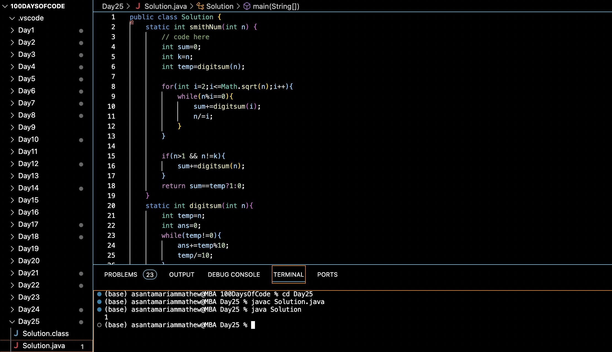

# SMITH NUMBER :blush:
## DAY :two: :five: -December 9, 2023

## Code Overview

The provided Java code is designed to determine whether a given number is a Smith number or not. A Smith number is a composite number whose sum of digits equals the sum of the digits of its prime factors (excluding 1).

## Key Features

- Identifies whether a given number is a Smith number or not.
- Calculates the sum of digits of a number.
- Iterates through the prime factors of the input number to compute their digit sums and compare with the input number's digit sum.

## Code Breakdown

The `Solution` class consists of the following methods:

- `smithNum(int n)`: This method takes an integer `n` as input and returns 1 if `n` is a Smith number, and 0 otherwise. It computes the sum of digits of `n` and iterates through its prime factors to calculate their digit sums. Finally, it compares the sum of digit sums with the sum of digits of `n`.
  
- `digitsum(int n)`: This method calculates the sum of digits of a given number `n`.
  
The `main` method demonstrates the usage of the `smithNum` method by passing a sample number (`648` in this case) and printing the result.

## Usage

1. Copy the code into your Java environment.
2. Ensure that you have the `Solution` class available.
3. Call the `smithNum` method with the number you want to check for Smith property.
4. It will return 1 if the number is a Smith number and 0 otherwise.

## Output

## Link
<https://auth.geeksforgeeks.org/user/asantamarptz2>