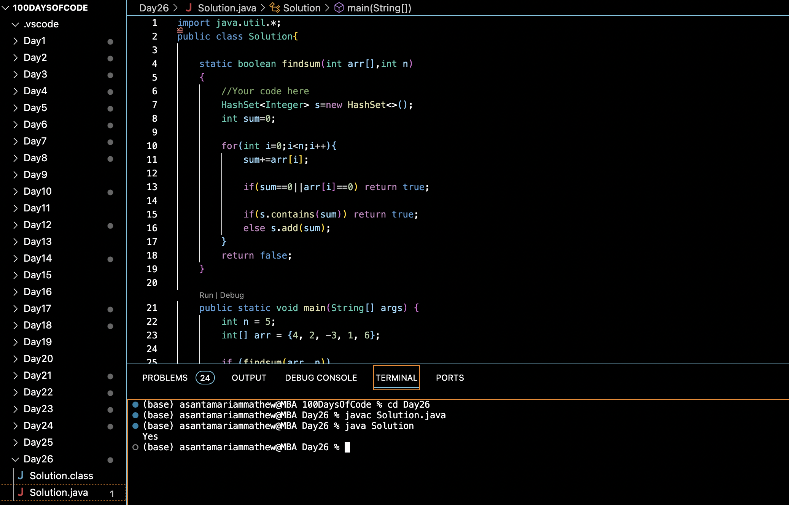

# SUBARRAY WITH 0 SUM :blush:
## DAY :two: :six: -December 10, 2023

## Code Overview

The provided Java code is designed to determine whether there exists a subarray with a sum equal to 0. It utilizes a HashSet to keep track of cumulative sums encountered while traversing the array.

## Key Features

- Checks if there exists a subarray with a sum equal to 0.
- Utilizes HashSet to efficiently store and retrieve cumulative sums.
- Returns true if such a subarray exists, otherwise returns false.

## Code Breakdown

The `Solution` class consists of the following methods:

- `findsum(int arr[],int n)`: This method takes an integer array `arr` and its size `n` as input and returns true if there exists a subarray with a sum equal to 0, otherwise returns false. It iterates through the array, keeping track of cumulative sums. If the current sum is found in the HashSet, it indicates the presence of a subarray with sum 0.

The `main` method demonstrates the usage of the `findsum` method by passing a sample array (`{4, 2, -3, 1, 6}` in this case) and printing "Yes" if a subarray with sum 0 exists, otherwise "No".

## Usage

1. Copy the code into your Java environment.
2. Ensure that you have the `Solution` class available.
3. Call the `findsum` method with the array you want to check and its size.
4. It will return true if there exists a subarray with sum 0, and false otherwise.

## Output

## Link
<https://auth.geeksforgeeks.org/user/asantamarptz2>