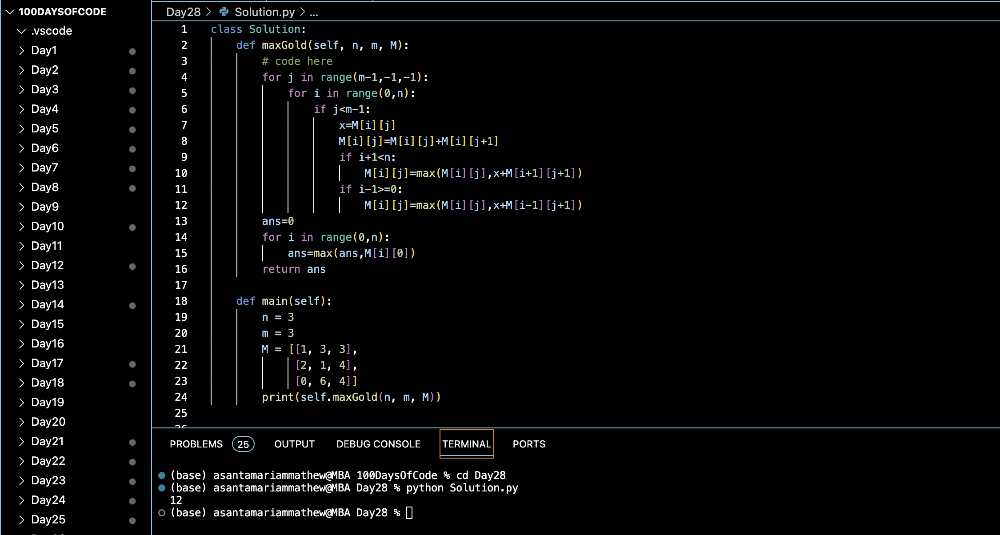

# GOLD MINE PROBLEM :blush:
## DAY :two: :eight: -December 12, 2023

## Code Overview

The provided Python code aims to find the maximum amount of gold that can be collected starting from the first column of a 2D grid and moving only right, right-up, or right-down.

## Key Features

- Finds the maximum amount of gold that can be collected from a given 2D grid.
- Utilizes dynamic programming and a bottom-up approach to efficiently compute the maximum amount of gold.
- Considers movement constraints (only right, right-up, or right-down) to calculate the maximum gold collection.

## Code Breakdown

The `Solution` class contains two methods:

- `maxGold(self, n, m, M)`: This method takes three parameters: `n` (number of rows), `m` (number of columns), and `M` (the 2D grid representing the gold mine). It iterates over the grid from right to left, and for each cell, computes the maximum amount of gold that can be collected starting from that cell and moving towards the first column. It uses dynamic programming to store and update intermediate results efficiently.
- `main(self)`: This method serves as the entry point of the program. It initializes the input parameters (`n`, `m`, and `M`) and prints the result obtained from the `maxGold` method.

The `if __name__ == "__main__":` block ensures that the `main` method is executed when the script is run as the main program.

## Usage

1. Copy the code into your Python environment.
2. Ensure that you have the `Solution` class available.
3. Provide the necessary input parameters (`n`, `m`, and `M`) to represent the 2D grid of the gold mine.
4. Call the `main` method of the `Solution` class.
5. It will print the maximum amount of gold that can be collected.

## Output

## Link
<https://auth.geeksforgeeks.org/user/asantamarptz2>
