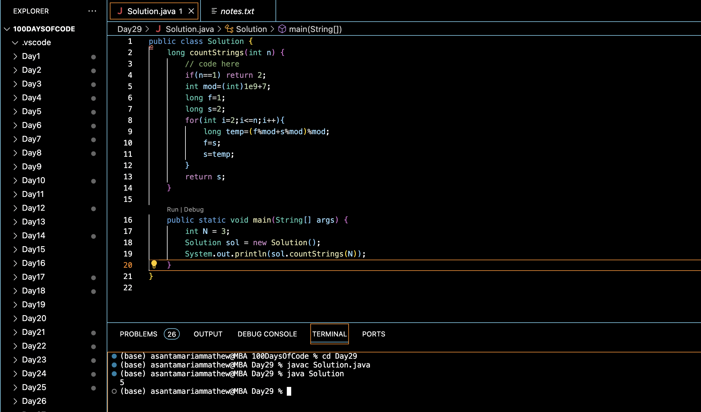

# CONSECUTIVE 1's NOT ALLOWED :blush:
## DAY :two: :nine: -December 13, 2023

## Code Overview

The provided Java code is aimed at counting the number of binary strings of length `n` that do not contain any consecutive 1s. It employs dynamic programming to efficiently compute the count of such strings.

## Key Features

- Counts the number of binary strings of length `n` without consecutive 1s.
- Utilizes dynamic programming to compute the count efficiently.
- Handles modular arithmetic to prevent overflow for large inputs.

## Code Breakdown

The `Solution` class contains the following methods:

- `countStrings(int n)`: This method takes an integer `n` as input and returns the count of binary strings of length `n` without consecutive 1s. It iterates from 2 to `n`, computing the count of valid strings using dynamic programming. It employs two variables `f` and `s` to store the counts of strings of length `i-1` and `i`, respectively, updating them in each iteration.

The `main` method demonstrates the usage of the `countStrings` method by providing a sample input `N = 3` and printing the result.

## Usage

1. Copy the code into your Java environment.
2. Ensure that you have the `Solution` class available.
3. Provide the desired length of binary strings `N`.
4. Call the `countStrings` method with the input parameter.
5. It will return the count of binary strings of length `N` without consecutive 1s.

## Output

## Link
<https://auth.geeksforgeeks.org/user/asantamarptz2>
