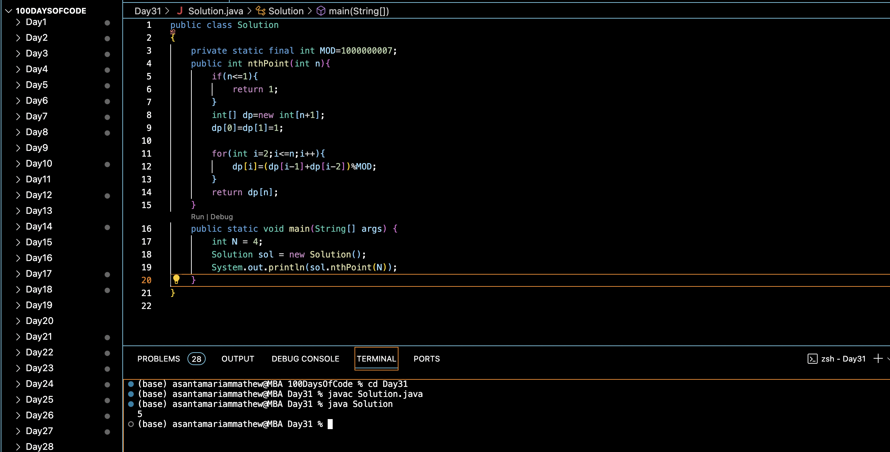

# REACH THE NTH POINT :blush:
## DAY :three: :one: -December 15, 2023

## Code Overview

The provided Java code is designed to calculate the number of ways to reach the nth point, given that a person can move either 1 or 2 steps at a time. It employs dynamic programming to efficiently compute the count of ways while considering a modulo operation to prevent overflow.

## Key Features

- Calculates the number of ways to reach the nth point using either 1 or 2 steps at a time.
- Utilizes dynamic programming to compute the count of ways efficiently.
- Handles large values and prevents overflow by using modulo arithmetic.

## Code Breakdown

The `Solution` class contains the following methods:

- `nthPoint(int n)`: This method takes an integer `n` representing the target point and returns the count of ways to reach that point. It utilizes dynamic programming to compute the count of ways by considering the previous two points and storing them in an array `dp`.

The `main` method demonstrates the usage of the `nthPoint` method by providing a sample input `N = 4` and printing the result.

## Usage

1. Copy the code into your Java environment.
2. Ensure that you have the `Solution` class available.
3. Provide the desired target point `N`.
4. Call the `nthPoint` method with the input parameter.
5. It will return the count of ways to reach the nth point.

## Output

## Link
<https://auth.geeksforgeeks.org/user/asantamarptz2>
