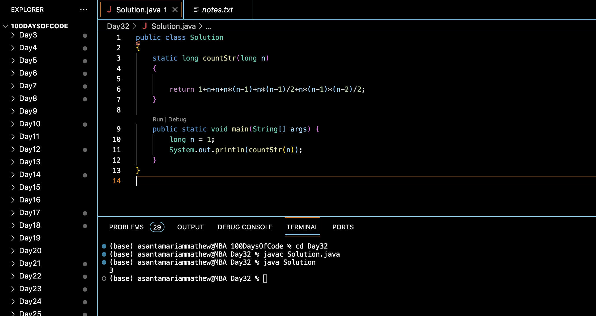

# STRING's COUNT :blush:
## DAY :three: :two: -December 16, 2023

## Code Overview

The provided Java code aims to calculate the total count of strings of length up to `n` that can be formed using the characters 'a', 'b', and 'c', where no two consecutive characters are the same. It computes the count using a formula based on combinatorics.

## Key Features

- Computes the total count of strings without consecutive identical characters up to length `n`.
- Utilizes a mathematical formula to efficiently calculate the count.
- Requires only a single method to determine the count.

## Code Breakdown

The `Solution` class contains the following methods:

- `countStr(long n)`: This method takes an integer `n` representing the maximum length of strings and returns the total count of strings of length up to `n` without consecutive identical characters. It uses a mathematical formula to calculate the count based on the combinatorial concept of permutations and combinations.

The `main` method demonstrates the usage of the `countStr` method by providing a sample input `n = 1` and printing the result.

## Usage

1. Copy the code into your Java environment.
2. Ensure that you have the `Solution` class available.
3. Provide the desired maximum length of strings `n`.
4. Call the `countStr` method with the input parameter.
5. It will return the total count of strings without consecutive identical characters up to length `n`.

## Output

## Link
<https://auth.geeksforgeeks.org/user/asantamarptz2>