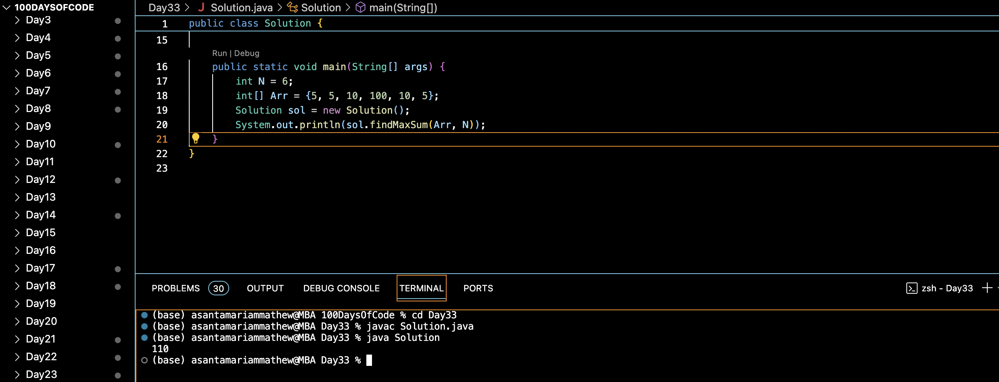

# MAX SUM WITHOUT ADJACENTS :blush:
## DAY :three: :three: -December 17, 2023

## Code Overview

The provided Java code aims to find the maximum possible sum of a subsequence in an array such that no two elements are adjacent. It implements a dynamic programming approach to efficiently compute the maximum sum.

## Key Features

- Finds the maximum possible sum of a subsequence with no adjacent elements.
- Utilizes dynamic programming to optimize the computation of the maximum sum.
- Handles cases where the input array has only one element.

## Code Breakdown

The `Solution` class contains the following methods:

- `findMaxSum(int arr[], int n)`: This method takes an integer array `arr` and its length `n` as input and returns the maximum possible sum of a subsequence with no adjacent elements. It iterates through the array using a dynamic programming approach, maintaining two variables `csm` (current sum with current element included) and `tsm` (total sum without current element included). It updates these variables in each iteration to find the maximum sum.

The `main` method demonstrates the usage of the `findMaxSum` method by providing a sample input array and its length, and then printing the result.

## Usage

1. Copy the code into your Java environment.
2. Ensure that you have the `Solution` class available.
3. Provide the input array `Arr` and its length `N`.
4. Call the `findMaxSum` method with the input parameters.
5. It will return the maximum possible sum of a subsequence with no adjacent elements.

## Output

## Link
<https://auth.geeksforgeeks.org/user/asantamarptz2>
