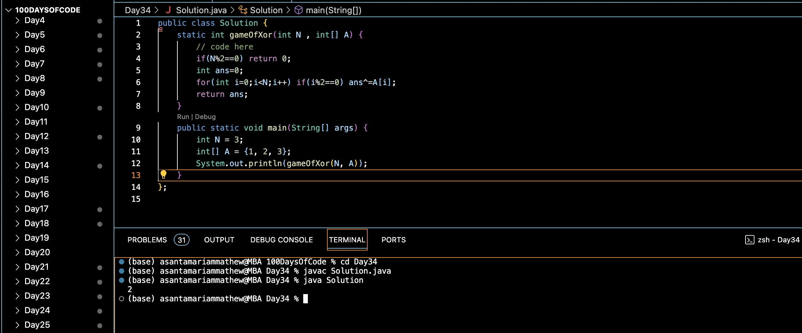

# GAME OF XOR :blush:
## DAY :three: :four: -December 18, 2023

## Code Overview

The provided Java code aims to implement a game of XOR where the XOR operation is applied to alternate elements of an array. The code calculates the XOR result of selected elements based on the length of the array.

## Key Features

- Implements a game of XOR where XOR operation is applied to alternate elements of the array.
- Checks if the length of the array is even, returning 0 if true.
- Utilizes bitwise XOR operation to compute the result.

## Code Breakdown

The `Solution` class contains the following methods:

- `gameOfXor(int N, int[] A)`: This method takes an integer `N` representing the length of the array `A` and an array of integers `A`. It calculates the XOR result of alternate elements of the array `A` based on the index and returns the result.
  
The `main` method demonstrates the usage of the `gameOfXor` method by providing a sample input array `A` and its length `N`, and then printing the result.

## Usage

1. Copy the code into your Java environment.
2. Ensure that you have the `Solution` class available.
3. Provide the desired input array `A` and its length `N`.
4. Call the `gameOfXor` method with the input parameters.
5. It will return the XOR result of alternate elements of the array `A`.

## Output

## Link
<https://auth.geeksforgeeks.org/user/asantamarptz2>