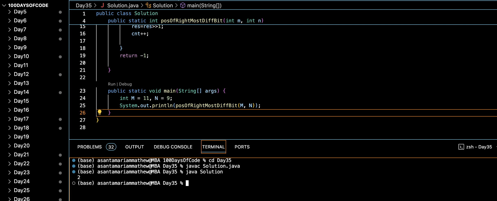

# RIGHTMOST DIFFERENT BIT :blush:
## DAY :three: :five: -December 19, 2023

## Code Overview

The provided Java code aims to find the position of the rightmost different bit between two integers `m` and `n`. It implements a bitwise XOR operation to find the differing bits and then iterates through the bits to find the rightmost differing bit position.

## Key Features

- Implements a function to find the position of the rightmost different bit between two integers.
- Utilizes bitwise XOR operation to identify the differing bits between the integers.
- Iterates through the bits to determine the position of the rightmost differing bit.

## Code Breakdown

The `Solution` class contains the following methods:

- `posOfRightMostDiffBit(int m, int n)`: This method takes two integers `m` and `n` as input and returns the position of the rightmost differing bit between them. It calculates the XOR of `m` and `n` to find the differing bits, then iterates through the bits to find the position of the rightmost differing bit.

The `main` method demonstrates the usage of the `posOfRightMostDiffBit` method by providing sample inputs `M = 11` and `N = 9`, and then printing the result.

## Usage

1. Copy the code into your Java environment.
2. Ensure that you have the `Solution` class available.
3. Provide the desired integers `M` and `N`.
4. Call the `posOfRightMostDiffBit` method with the input parameters.
5. It will return the position of the rightmost differing bit between the integers.

## Output

## Link
<https://auth.geeksforgeeks.org/user/asantamarptz2>
