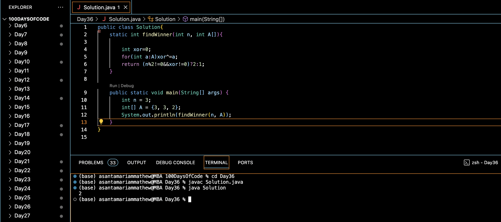

# MODIFIED GAME OF NIM :blush:
## DAY :three: :six: -December 20, 2023

## Code Overview

The provided Java code determines the winner of a game based on a given set of numbers and the number of rounds played. It calculates the winner by performing bitwise XOR operations on the given numbers and determining if the result is non-zero for an odd number of rounds.

## Key Features

- Determines the winner of a game based on a set of numbers and the number of rounds played.
- Utilizes bitwise XOR operations to calculate the cumulative result of the game.
- Considers the parity of the number of rounds to determine the winner.

## Code Breakdown

The `Solution` class contains the following methods:

- `findWinner(int n, int A[])`: This method takes an integer `n` representing the number of rounds played and an array `A[]` containing the numbers played in each round. It calculates the winner by performing bitwise XOR operations on all the numbers played and returns 1 if the result is zero or 2 if the result is non-zero and the number of rounds is odd.

The `main` method demonstrates the usage of the `findWinner` method by providing a sample input `n = 3` and `A = {3, 3, 2}`, and then printing the result.

## Usage

1. Copy the code into your Java environment.
2. Ensure that you have the `Solution` class available.
3. Provide the desired number of rounds `n` and the array of numbers played `A`.
4. Call the `findWinner` method with the input parameters.
5. It will return the winner of the game based on the provided inputs.

## Output

## Link
<https://auth.geeksforgeeks.org/user/asantamarptz2>