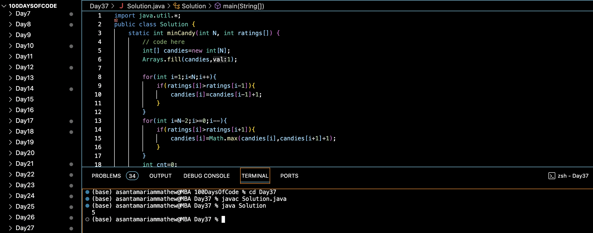

# CANDY :blush:
## DAY :three: :seven: -December 21, 2023

## Code Overview

The provided Java code calculates the minimum number of candies required to distribute among children based on their ratings. The distribution of candies follows two rules: each child must have at least one candy, and a child with a higher rating must have more candies than their adjacent child with a lower rating.

## Key Features

- Utilizes arrays to store the number of candies each child receives.
- Implements two passes through the ratings array to ensure the distribution follows the specified rules.
- Uses the `Arrays.fill` method to initialize the candies array with one candy for each child.
- Calculates the total number of candies required for distribution.

## Code Breakdown

The `Solution` class contains the following methods:

- `minCandy(int N, int ratings[])`: This method takes an integer `N` representing the number of children and an array `ratings[]` containing the ratings of each child. It calculates the minimum number of candies required to distribute among children based on their ratings and returns the total number of candies needed.

The `main` method demonstrates the usage of the `minCandy` method by providing a sample input `N = 3` and `ratings = {1, 0, 2}`, and then printing the result.

## Usage

1. Copy the code into your Java environment.
2. Ensure that you have the `Solution` class available.
3. Provide the desired number of children `N` and an array of ratings `ratings`.
4. Call the `minCandy` method with the input parameters.
5. It will return the minimum number of candies required for distribution based on the provided ratings.

## Output

## Link
<https://auth.geeksforgeeks.org/user/asantamarptz2>