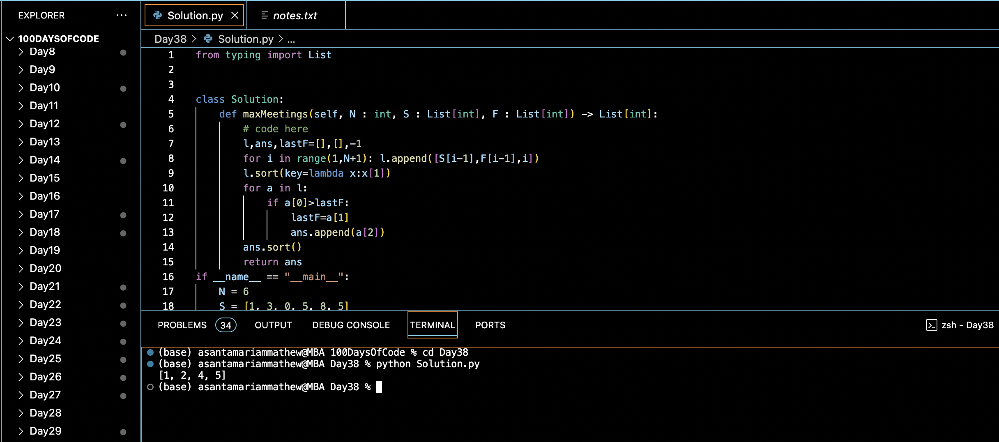

# MAXIMUM MEETINGS IN ONE ROOM :blush:
## DAY :three::eight: -December 22, 2023

## Code Overview

The provided Python code calculates the maximum number of meetings that can be scheduled based on the given start and finish times of each meeting. It sorts the meetings based on their finish times and selects the meetings that do not overlap with each other.

## Key Features

- Utilizes a class-based approach with a method `maxMeetings` to calculate the maximum number of meetings.
- Accepts input parameters `N` (the number of meetings), `S` (the list of start times), and `F` (the list of finish times).
- Sorts the meetings based on their finish times to prioritize meetings with earlier finishes.
- Iterates through the sorted meetings and selects non-overlapping meetings to maximize the number of scheduled meetings.

## Code Breakdown

The `Solution` class contains the following method:

- `maxMeetings(self, N: int, S: List[int], F: List[int]) -> List[int]`: This method takes three parameters: `N` representing the number of meetings, `S` representing the start times of meetings, and `F` representing the finish times of meetings. It sorts the meetings based on their finish times, iterates through them to select non-overlapping meetings, and returns a list of indices representing the selected meetings.

The `if __name__ == "__main__":` block demonstrates the usage of the `maxMeetings` method by providing a sample input and then printing the result.

## Usage

1. Copy the code into your Python environment.
2. Ensure that you have the `Solution` class available.
3. Provide the desired input parameters `N`, `S`, and `F`.
4. Create an instance of the `Solution` class.
5. Call the `maxMeetings` method with the input parameters.
6. It will return a list of indices representing the selected meetings.

## Output

## Link
<https://auth.geeksforgeeks.org/user/asantamarptz2>
