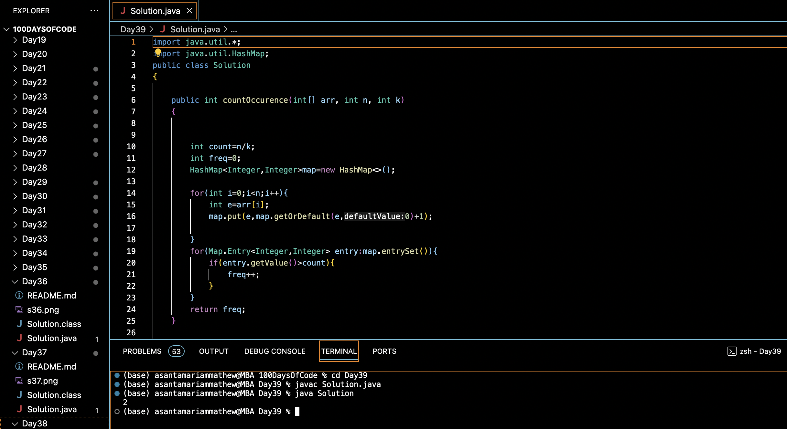

# COUNT MORE THAN N/K OCCURENCES :blush:
## DAY :three: :nine: -December 23, 2023

## Code Overview
This Java program counts the occurrences of elements in an array within a specified range. It calculates the frequency of elements that appear more than a certain number of times within the given range.

## Key Features
- Efficiently counts the occurrences of elements in an array within a specified range.
- Utilizes a HashMap to store element frequencies.
- Handles integer inputs for array elements and range.

## Code Breakdown
The program consists of:
1. **`countOccurence` Method**: Calculates the occurrence count within a specified range.
    - Initializes a HashMap to store the frequencies of elements.
    - Iterates through each element of the array and updates its frequency in the HashMap.
    - Iterates through the HashMap entries and counts the elements whose frequency exceeds the specified threshold.
    - Returns the count of such elements.

2. **`main` Method**: The main entry point of the program.
    - Initializes the array `arr`, the size `N`, and the range `k`.
    - Calls the `countOccurence` method to count the occurrences within the range and prints the result.

## Usage

1. Compile the Java file using a Java compiler.
2. Run the compiled program.
3. The program will output the count of elements that appear more than `N/k` times within the range.

## Output

## Link
<https://auth.geeksforgeeks.org/user/asantamarptz2>
