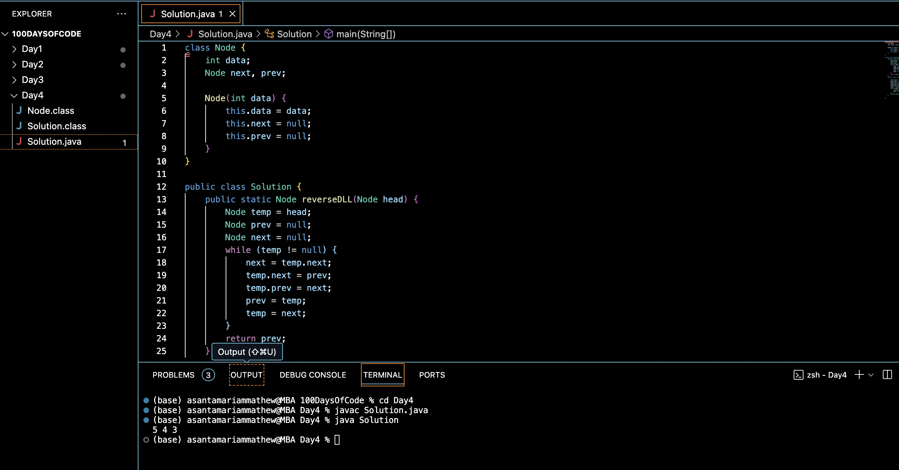

# REVERSE A DOUBLY LINKED LIST :blush:
## DAY :four: -November 18, 2023

## Code Overview
The code implements a Java solution to reverse a doubly linked list. It consists of two classes: Node representing a node in the doubly linked list, and Solution containing the logic to reverse the list and a main method demonstrating its usage.

## Key Features
**Doubly Linked List Reversal**: The code efficiently reverses a doubly linked list while preserving its structure.

**In-place Reversal**: The reversal process is performed in-place, meaning no additional data structures are used, resulting in optimal memory usage.

## Code Breakdown
**Node Class**: 

Defines a simple node structure with data, next, and prev pointers.

**Solution Class**:

-reverseDLL(Node head): Reverses the doubly linked list by traversing it once and updating the pointers appropriately.

-main(String[] args): Demonstrates the usage of the reverseDLL method by creating a sample doubly linked list, reversing it, and printing the reversed list.

## Usage
1. Ensure you have a Java development environment set up.
2. Copy the Node and Solution classes into your project.
3. Create a doubly linked list by initializing nodes and setting their next and prev pointers accordingly.
4. Call the reverseDLL method from the Solution class, passing the head of the doubly linked list as an argument.
5. Traverse the reversed list and perform necessary operations.

## Output

## Link
<https://auth.geeksforgeeks.org/user/asantamarptz2>

