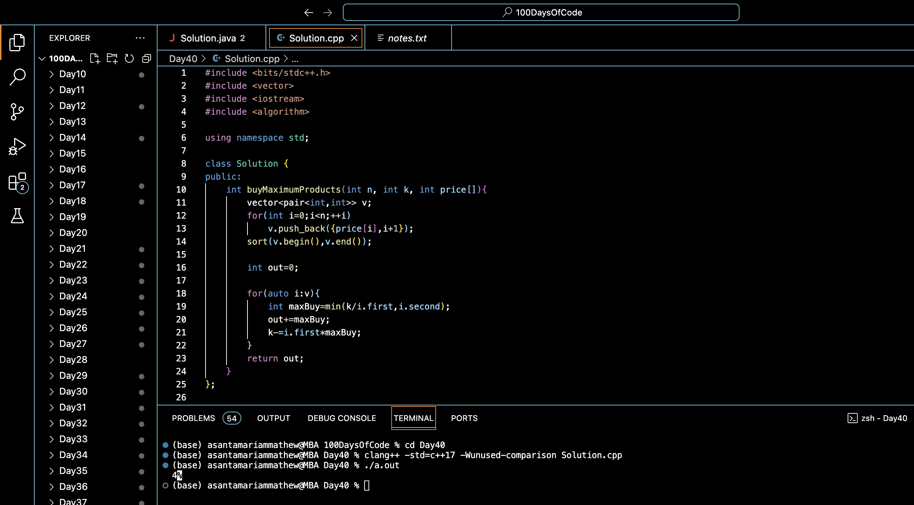

# BUY MAX STOCKS IF i STOCKS CAN BE BOUGHT ON i-th day :blush:
## DAY :four: :zero: -December 24, 2023

## Code Overview
This C++ program calculates the maximum number of products that can be bought with a given amount of money (`k`) and the prices of the products. It implements a solution to find the maximum number of products that can be bought within the budget.

## Key Features
- Efficiently calculates the maximum number of products that can be bought with the given budget and prices.
- Utilizes a vector of pairs to store the prices and corresponding product indices.
- Sorts the vector based on the prices to optimize the purchasing process.
- Handles cases where the budget may not be enough to purchase a whole product.

## Code Breakdown
The program consists of:
1. **`buyMaximumProducts` Method**: Calculates the maximum number of products that can be bought within the given budget and prices.
    - Initializes a vector of pairs `v` to store the prices and corresponding product indices.
    - Sorts the vector `v` based on the prices.
    - Iterates through each product in the sorted vector.
    - Determines the maximum number of units of the current product that can be bought within the budget (`k`).
    - Updates the total count of products bought (`out`) and decreases the remaining budget accordingly.
    - Returns the total count of products bought within the budget.
2. **`main` Function**: The main entry point of the program.
    - Initializes an array `price` containing the prices of the products and an integer `k` representing the budget.
    - Calculates the number of products in the array.
    - Calls the `buyMaximumProducts` method to determine the maximum number of products that can be bought within the budget and prints the result.

## Usage
To use this program:
1. Compile the C++ file using a C++ compiler.
2. Run the compiled program.
3. The program will output the maximum number of products that can be bought within the budget.

## Output

## Link
<https://auth.geeksforgeeks.org/user/asantamarptz2>
