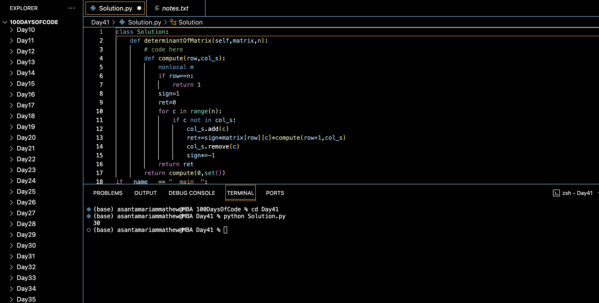

# DETERMINANT OF A MATRIX :blush:
## DAY :four: :one: -December 25, 2023

## Code Overview
This Python code defines a class named `Solution` containing a method `determinantOfMatrix` to calculate the determinant of a square matrix using the Laplace expansion method. It then demonstrates the usage of this method in the `main` function.

## Key Features
- **determinantOfMatrix Method**: Implements the `determinantOfMatrix` method to compute the determinant of a given square matrix `matrix` of size `n x n`. It utilizes a recursive approach to expand the determinant using cofactor expansion.
- **Recursive Approach**: The `compute` function within the `determinantOfMatrix` method recursively computes the determinant by considering each element of the first row and computing the cofactor for each element.
- **Non-local Variables**: Utilizes non-local variables to keep track of the current row and the set of columns already considered during the cofactor expansion.
- **Main Method**: Defines a `main` method to specify input parameters `n` and `matrix`, create an instance of the `Solution` class, call the `determinantOfMatrix` method, and print the result.

## Code Breakdown
- **Solution Class**: Defines a class named `Solution`.
  - **determinantOfMatrix Method**: Implements the method `determinantOfMatrix` to compute the determinant of a square matrix using the Laplace expansion method.
    - **compute Function**: Defines a nested function `compute` to recursively compute the determinant by cofactor expansion.
- **Main Method**: Defines a `main` method to handle input and output.
  - Specifies input parameters `n` and `matrix`.
  - Creates an instance of the `Solution` class.
  - Calls the `determinantOfMatrix` method with the specified parameters.
  - Prints the result.

## Usage
1. Copy the provided Python code into a Python environment or editor.
2. Modify the value of `n` and the `matrix` variable to specify a different square matrix for which you want to compute the determinant.
3. Run the code.
4. The program will output the determinant of the specified matrix.
5. Review the printed result to determine the determinant of the matrix.

## Output

## Link
<https://auth.geeksforgeeks.org/user/asantamarptz2>
