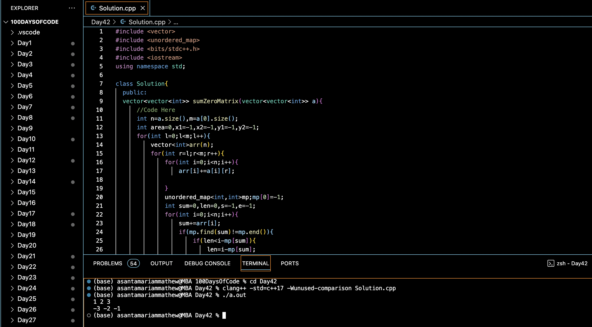

# LARGEST RECTANGULAR SUB-MATRIXWHOSE SUM IS 0 :blush:
## DAY :four: :two: -December 26, 2023

## Code Overview
This C++ program finds the maximum area submatrix with a sum of zero in a given matrix. It implements a solution to find the submatrix with the largest area that sums up to zero.

## Key Features
- Efficiently calculates the maximum area submatrix with a sum of zero in a given matrix.
- Utilizes dynamic programming and hashing to optimize the computation.
- Handles both positive and negative integers in the matrix.

## Code Breakdown
The program consists of:
1. **`sumZeroMatrix` Method**: Finds the maximum area submatrix with a sum of zero.
    - Iterates through each possible submatrix in the input matrix.
    - Computes the cumulative sum of elements in each column of the submatrix.
    - Utilizes hashing to find a subsequence with a sum of zero within each column cumulative sum.
    - Updates the maximum area submatrix if a larger one with a sum of zero is found.
    - Returns the maximum area submatrix with a sum of zero.

2. **`main` Function**: The main entry point of the program.
    - Initializes a matrix `mat` with integer values.
    - Calls the `sumZeroMatrix` method to find the maximum area submatrix with a sum of zero.
    - Prints the elements of the resulting submatrix.

## Usage

1. Compile the C++ file using a C++ compiler.
2. Run the compiled program.
3. The program will output the maximum area submatrix with a sum of zero.

## Output

## Link
<https://auth.geeksforgeeks.org/user/asantamarptz2>
