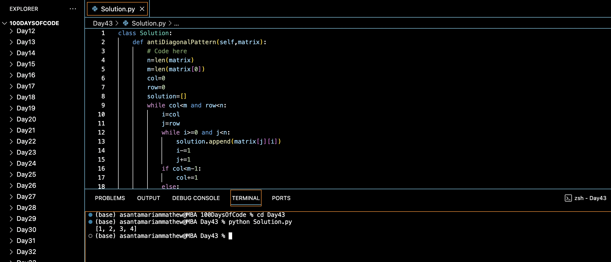

# ANTI DIAGONAL TRAVERSAL OF MATRIX :blush:
## DAY :four: :three: -December 27, 2023

## Code Overview
This Python code defines a class named `Solution` containing a method `antiDiagonalPattern` to traverse a matrix in an anti-diagonal pattern. It then demonstrates the usage of this method in the `main` function.

## Key Features
- **antiDiagonalPattern Method**: Implements the `antiDiagonalPattern` method to traverse the given matrix in an anti-diagonal pattern, appending each element to the `solution` list accordingly.
- **Iterative Approach**: Utilizes an iterative approach to traverse the matrix in an anti-diagonal pattern, updating the column (`col`) and row (`row`) indices accordingly.
- **Main Function**: Defines a `main` function to specify input parameters `N` and `matrix`, create an instance of the `Solution` class, call the `antiDiagonalPattern` method, and print the result.

## Code Breakdown
- **Solution Class**: Defines a class named `Solution`.
  - **antiDiagonalPattern Method**: Implements the method `antiDiagonalPattern` to traverse the given matrix in an anti-diagonal pattern.
- **Main Function**: Defines a `main` function to handle input and output.
  - Specifies input parameters `N` and `matrix`.
  - Creates an instance of the `Solution` class.
  - Calls the `antiDiagonalPattern` method with the specified parameters.
  - Prints the result.

## Usage
1. Copy the provided Python code into a Python environment or editor.
2. Modify the value of the `N` and `matrix` variable to specify a different matrix for which you want to traverse in an anti-diagonal pattern.
3. Run the code.
4. The program will output the elements of the matrix traversed in an anti-diagonal pattern.
5. Review the printed result to observe the anti-diagonal traversal of the matrix.

## Output

## Link
<https://auth.geeksforgeeks.org/user/asantamarptz2>
