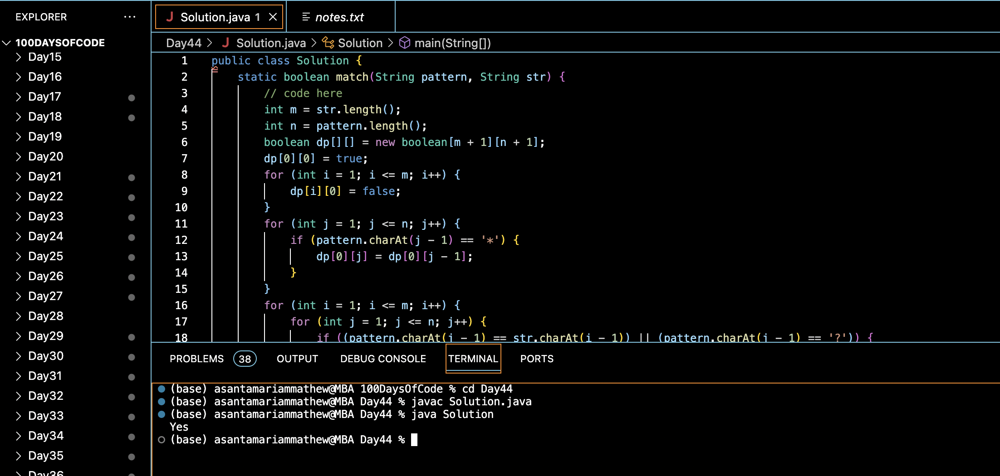

# WILDCARD STRING MATCHING :blush:
## DAY :four: :four: -December 28, 2023

## Code Overview
This Java code defines a class named `Solution` containing a static method `match` to determine whether a given pattern matches a given string. It implements dynamic programming to solve the wildcard pattern matching problem.

## Key Features
- **match Method**: Implements the `match` method to determine whether the pattern matches the string. It utilizes dynamic programming to efficiently solve the problem by considering wildcard characters (`*` and `?`).
- **Dynamic Programming Approach**: Utilizes a dynamic programming approach to build a boolean matrix `dp`, where `dp[i][j]` represents whether the pattern up to index `j` matches the string up to index `i`.
- **Wildcard Handling**: Handles wildcard characters `*` and `?` in the pattern to represent any sequence of characters and any single character, respectively.
- **Main Method**: Defines a `main` method to handle input and output. It specifies the wild pattern and the pattern string, calls the `match` method, and prints "Yes" if there's a match, otherwise prints "No".

## Code Breakdown
- **Solution Class**: Defines a class named `Solution`.
  - **match Method**: Implements the static method `match` to determine whether the pattern matches the string using dynamic programming.
- **Main Method**: Defines a `main` method to handle input and output.
  - Specifies input parameters `wild` and `pattern`.
  - Calls the `match` method with the specified parameters.
  - Prints "Yes" if there's a match between the wild pattern and the string, otherwise prints "No".

## Usage
1. Copy the provided Java code into a Java environment or editor.
2. Modify the values of `wild` and `pattern` to specify the wildcard pattern and the pattern string for which you want to determine the match.
3. Run the code.
4. The program will output "Yes" if there's a match between the wild pattern and the string, otherwise it will output "No".
5. Review the printed result to determine whether there's a match between the wild pattern and the string.

## Output

## Link
<https://auth.geeksforgeeks.org/user/asantamarptz2>
