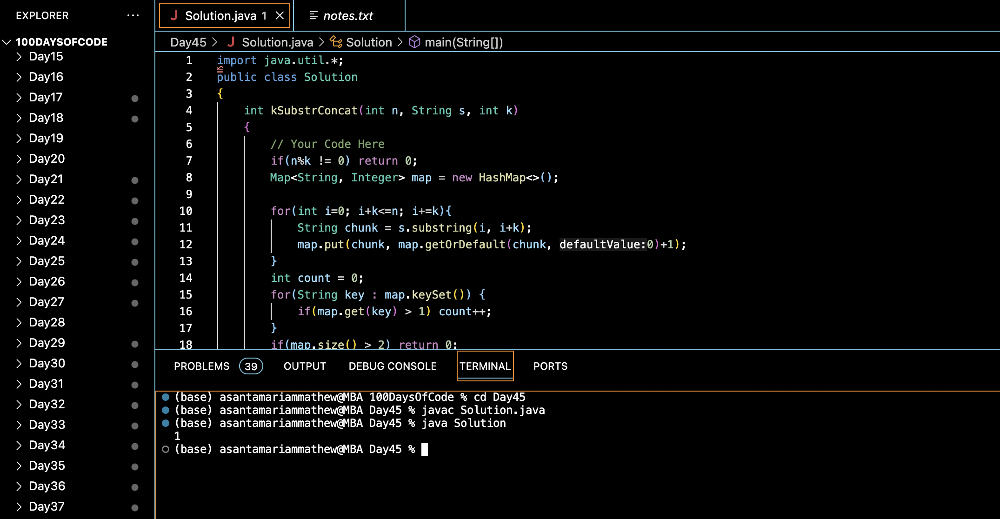

# CHECK IF A STRING IS REPETITION OF IT's SUBSTRING OF K-LENGTH:blush:
## DAY :four: :five: -December 29, 2023

## Code Overview
This Java code defines a class named `Solution` with a method `kSubstrConcat` to determine if a string can be partitioned into substrings of equal length such that each substring occurs at least twice, and there are at most two different substrings.

## Key Features
- **kSubstrConcat Method**: Implements the `kSubstrConcat` method to solve the problem by partitioning the string into substrings of length `k` and counting the occurrences of each substring using a `HashMap`.
- **Validation**: Checks if the length of the string is divisible by `k`, ensuring each substring has the same length.
- **Map Usage**: Utilizes a `HashMap` to store the count of each substring encountered while iterating through the string.
- **Main Method**: Defines a `main` method to handle input and output. It specifies the length of the string `N`, the length of each substring `K`, and the string `S`.
- **Output Handling**: Calls the `kSubstrConcat` method with the input parameters and prints the result.

## Code Breakdown
- **Solution Class**: Defines a class named `Solution`.
  - **kSubstrConcat Method**: Implements the `kSubstrConcat` method to solve the problem by partitioning the string into substrings of length `k` and counting the occurrences of each substring.
- **Main Method**: Defines a `main` method to handle input and output.
  - Specifies input parameters `N`, `K`, and `S`.
  - Calls the `kSubstrConcat` method with the specified parameters.
  - Prints the result returned by the `kSubstrConcat` method.

## Usage
1. Copy the provided Java code into a Java environment or editor.
2. Modify the values of `N`, `K`, and `S` to specify the length of the string, the length of each substring, and the string itself.
3. Run the code.
4. The program will output `1` if the string can be partitioned as required, and `0` otherwise.
5. Review the printed result to determine if the string satisfies the given conditions.

## Output

## Link
<https://auth.geeksforgeeks.org/user/asantamarptz2>
