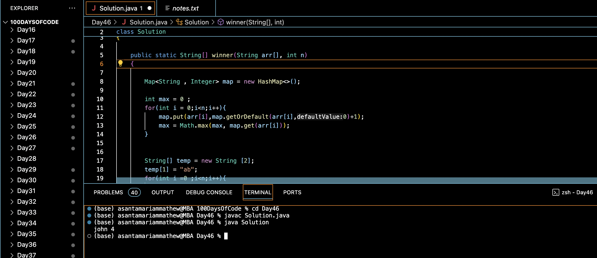

# WINNER OF AN ELECTION :blush:
## DAY :four: :six: -December 30, 2023

## Code Overview
This Java code defines a `Solution` class that includes a method `winner()` to determine the winner among a group of participants based on the maximum occurrence of their names in an array. The `main()` function demonstrates the usage of the `winner()` method with sample data.

## Key Features
- Utilizes a HashMap to store the frequency of each participant's name.
- Determines the participant with the highest frequency of occurrence as the winner.
- Resolves ties using lexicographical order, selecting the participant whose name comes first.

## Code Breakdown
-  **`winner(String arr[], int n)` Method**: 
   - Initializes a HashMap to store the frequency of each participant's name.
   - Iterates through the array to count the occurrences of each name and find the maximum occurrence.
   - Determines the winner based on the highest frequency, resolving ties using lexicographical order.
   - Returns an array containing the winner's name and their frequency of occurrence.

- **`main(String[] args)` Method**:
   - Demonstrates the usage of the `winner()` method with sample data.
   - Prints the name of the winner along with their frequency of occurrence.

## Usage

1. Define an array of strings containing the names of participants.
2. Call the `winner()` method with the array and its length (`n`).
3. Retrieve the result containing the winner's name and their frequency of occurrence.

## Output

## Link
<https://auth.geeksforgeeks.org/user/asantamarptz2>