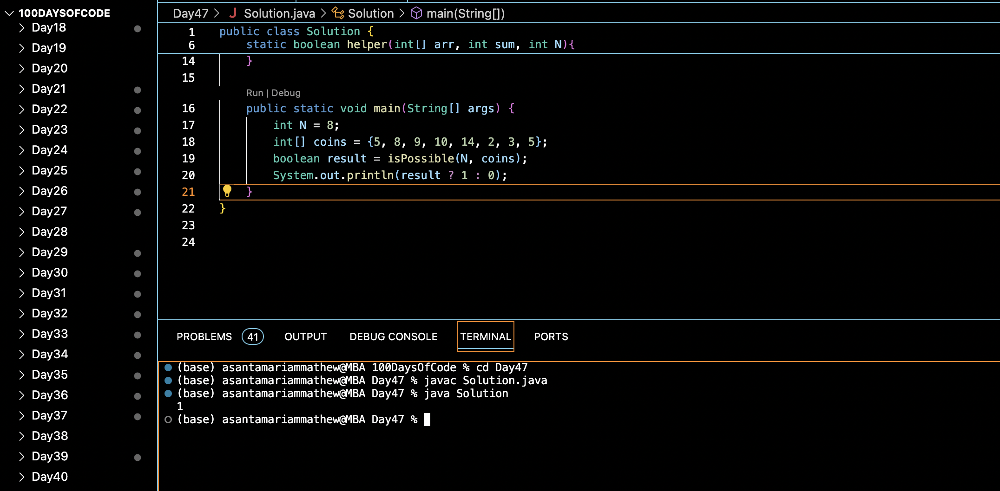

# NEW YEAR RESOLUTION :blush:
## DAY :four: :seven: -December 31, 2023

## Code Overview
This Java code defines a class `Solution` that includes a method `isPossible()` to determine whether it's possible to obtain a sum that is divisible by either 20, 24, or 2024 by selecting some elements from a given array of coins. The `main()` function demonstrates the usage of the `isPossible()` method with sample data.

## Key Features
- Utilizes recursion to explore all possible combinations of coins.
- Checks if the sum of selected coins is divisible by 20, 24, or 2024.
- Returns true if such a sum is possible, otherwise returns false.

## Code Breakdown
- **`isPossible(int N, int[] coins)` Method**: 
   - Initiates the recursion by calling the `helper()` method with the given array of coins, initial sum 0, and length `N`.
   - Returns the result obtained from the `helper()` method.

- **`helper(int[] arr, int sum, int N)` Method**:
   - Checks if the current sum is divisible by 20, 24, or 2024. If yes, returns true.
   - Base case: If `N` (the number of coins) becomes 0, returns false.
   - Recursively explores all possible combinations of selecting and not selecting coins.
   - Returns true if any combination results in a sum divisible by 20, 24, or 2024, otherwise false.

- **`main(String[] args)` Method**:
   - Demonstrates the usage of the `isPossible()` method with sample data.
   - Prints the result as 1 if it's possible to obtain a divisible sum, otherwise prints 0.

## Usage

1. Define the number of coins (`N`) and an array of integers representing the values of the coins.
2. Call the `isPossible()` method with `N` and the array of coins.
3. Retrieve the boolean result indicating whether it's possible to obtain a sum divisible by 20, 24, or 2024.

## Output

## Link
<https://auth.geeksforgeeks.org/user/asantamarptz2>