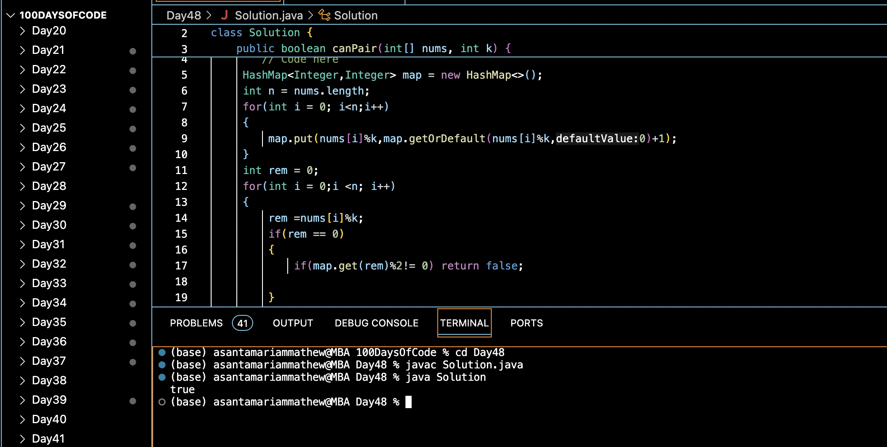

# ARRAY PAIR SUM DIVISIBILITY PROBLEM :blush:
## DAY :four: :eight: -January 1, 2024

# Code Overview
This Java code defines a class `Solution` that includes a method `canPair()` to determine whether there exists a pair of elements in the given array `nums` whose sum is divisible by `k`. The `main()` function demonstrates the usage of the `canPair()` method with sample data.

## Key Features
- Utilizes a HashMap to store the remainders of elements when divided by `k`.
- Checks whether each element's remainder and its complement's remainder add up to `k`.
- Returns true if such a pair exists, otherwise returns false.

## Code Breakdown
1. **`canPair(int[] nums, int k)` Method**: 
   - Initializes a HashMap to store the remainders of elements when divided by `k`, along with their frequencies.
   - Iterates through the array to populate the HashMap.
   - Checks each element's remainder and its complement's remainder to see if they add up to `k`.
   - Returns true if a valid pair is found, otherwise false.

2. **`main(String[] args)` Method**:
   - Demonstrates the usage of the `canPair()` method with sample data.
   - Prints the result obtained from the `canPair()` method.

## Usage

1. Define an array of integers (`nums`) and an integer `k`.
2. Create an instance of the `Solution` class.
3. Call the `canPair()` method with the array `nums` and integer `k`.
4. Retrieve the boolean result indicating whether a pair of elements with a sum divisible by `k` exists.

## Output

## Link
<https://auth.geeksforgeeks.org/user/asantamarptz2>
