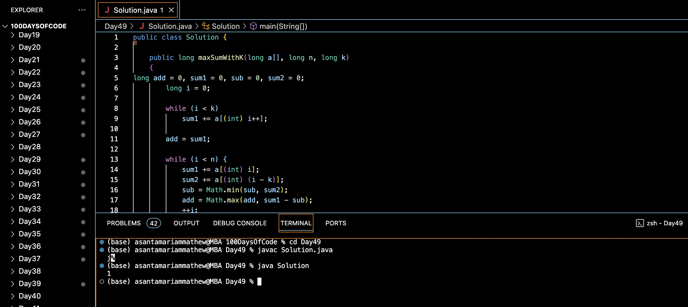

# LARGEST SUM SUBARRAY OF SIZE AT LEAST K :blush:
## DAY :four: :nine: -January 2, 2024

## Code Overview
This Java code defines a class `Solution` that includes a method `maxSumWithK()` to find the maximum possible sum of a subarray of size `k` within a given array. The `main()` function demonstrates the usage of the `maxSumWithK()` method with sample data.

## Key Features
- Iteratively computes the sum of the first `k` elements to initialize the maximum sum.
- Slides a window of size `k` over the array, updating the maximum sum as necessary.
- Utilizes dynamic programming to efficiently calculate the maximum sum.

## Code Breakdown
1. **`maxSumWithK(long a[], long n, long k)` Method**: 
   - Initializes variables to store the current sum (`sum1`), the maximum sum (`add`), the minimum sum of a subarray of size `k` (`sub`), and the sum of the previous `k` elements (`sum2`).
   - Calculates the initial sum of the first `k` elements.
   - Slides a window of size `k` over the array, updating the sums and the maximum sum as necessary.
   - Returns the maximum sum.

2. **`main(String[] args)` Method**:
   - Demonstrates the usage of the `maxSumWithK()` method with sample data.
   - Prints the result obtained from the `maxSumWithK()` method.

## Usage
To use this code:
1. Create an instance of the `Solution` class.
2. Define an array of long integers (`a`), the size of the array (`n`), and the size of the subarray (`k`).
3. Call the `maxSumWithK()` method with the array `a`, size `n`, and subarray size `k`.
4. Retrieve the long integer result representing the maximum sum of a subarray of size `k`.

## Output

## Link
<https://auth.geeksforgeeks.org/user/asantamarptz2>
