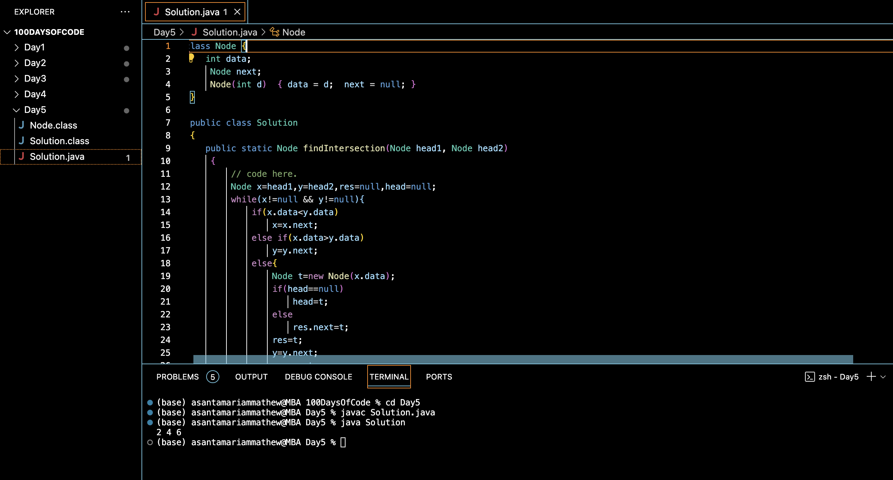

# INTERSECTION OF TWO SORTED LINKED LISTS:blush:
## DAY :five: -November 19, 2023

## Code Overview
The code offers a Java solution to find the intersection of two sorted singly linked lists. It defines a Node class representing a node in the linked list and a Solution class containing a method to find the intersection.

## Key Features

**Intersection Finding**: The code efficiently finds the intersection of two sorted singly linked lists.

**In-place Operation**: The intersection is determined without modifying the original lists, ensuring minimal space complexity.

## Code Breakdown

**Node Class**: 

Represents a node in the singly linked list, storing integer data and a reference to the next node.

**Solution Class**:

-findIntersection(Node head1, Node head2): Iterates through both lists simultaneously, identifying common elements to form the intersection list.

-main(String[] args): Demonstrates the usage of the findIntersection method by creating two sample linked lists, finding their intersection, and printing the intersecting elements.

## Usage
1. Ensure you have a Java development environment configured.
2. Copy the Node and Solution classes into your project.
3. Create two sorted singly linked lists by initializing nodes and setting their next pointers accordingly.
4. Call the findIntersection method from the Solution class, passing the heads of both lists as arguments.
5. Traverse the resulting intersection list and perform necessary operations.

## Output

## Link
<https://auth.geeksforgeeks.org/user/asantamarptz2>
