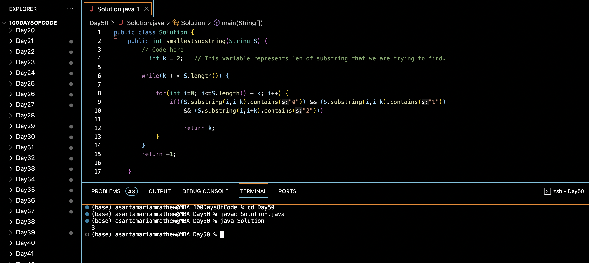

# SMALLEST WINDOW CONTAINING 0,1 AND 2 :blush:
## DAY :five: :zero: -January 3, 2024

## Code Overview
This Java code defines a class `Solution` that includes a method `smallestSubstring()` to find the length of the smallest substring of a given string `S` containing all three characters '0', '1', and '2'. The `main()` function demonstrates the usage of the `smallestSubstring()` method with sample data.

## Key Features
- Iteratively checks substrings of increasing length to find the smallest substring containing '0', '1', and '2'.
- Uses nested loops to iterate through all possible substrings.
- Returns the length of the smallest substring if found, otherwise returns -1.

## Code Breakdown
1. **`smallestSubstring(String S)` Method**: 
   - Initializes a variable `k` representing the length of the substring to find.
   - Iterates through substrings of length `k` to `S.length()` using a nested loop.
   - Checks if each substring contains all three characters '0', '1', and '2'.
   - Returns the length of the smallest substring if found, otherwise returns -1.

2. **`main(String[] args)` Method**:
   - Demonstrates the usage of the `smallestSubstring()` method with sample data.
   - Prints the result obtained from the `smallestSubstring()` method.

## Usage

1. Create an instance of the `Solution` class.
2. Define a string `S`.
3. Call the `smallestSubstring()` method with the string `S`.
4. Retrieve the integer result representing the length of the smallest substring containing '0', '1', and '2'.

## Output

## Link
<https://auth.geeksforgeeks.org/user/asantamarptz2>