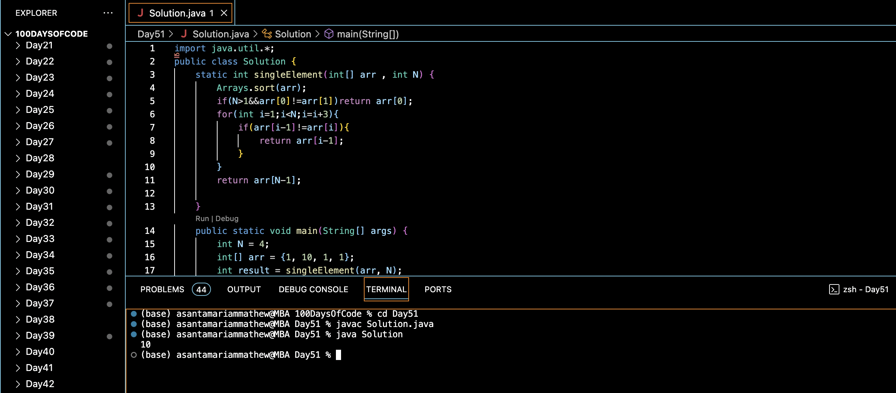

# FIND THE ELEMENT OCCURING ONCE WHEN ALL OTHER ARE OCCURING THRICE :blush:
## DAY :five: :one: -January 4, 2024

## Code Overview
This Java code defines a class `Solution` that includes a method `singleElement()` to find the single element in an array that appears only once, while all other elements appear exactly thrice. The `main()` function demonstrates the usage of the `singleElement()` method with sample data.

## Key Features
- Sorts the input array to group identical elements together.
- Utilizes a loop to iterate through the sorted array and find the single element.
- Returns the single element that appears only once, while all other elements appear thrice.

## Code Breakdown
1. **`singleElement(int[] arr, int N)` Method**: 
   - Sorts the input array `arr` using the `Arrays.sort()` method.
   - Checks if the first element is distinct. If so, returns it.
   - Iterates through the sorted array in steps of 3, checking each group of three adjacent elements.
   - Returns the single element that appears only once, while all other elements appear thrice.

2. **`main(String[] args)` Method**:
   - Demonstrates the usage of the `singleElement()` method with sample data.
   - Prints the result obtained from the `singleElement()` method.

## Usage

1. Define the size of the array (`N`) and create an array of integers (`arr`).
2. Call the `singleElement()` method with the array `arr` and its size `N`.
3. Retrieve the integer result representing the single element that appears only once.

## Output

## Link
<https://auth.geeksforgeeks.org/user/asantamarptz2>
