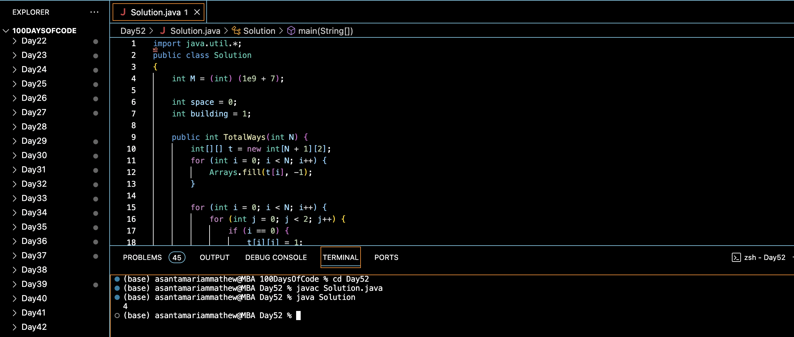

#  FIND POSSIBLE WAYS TO CONSTRUCT BUILDINGS:blush:
## DAY :five: :two: -January 5, 2024

## Code Overview
This Java code defines a class `Solution` that includes a method `TotalWays()` to calculate the total number of ways to construct a binary string of length `N` with no consecutive ones. The `main()` function demonstrates the usage of the `TotalWays()` method with sample data.

## Key Features
- Utilizes dynamic programming to efficiently calculate the total number of ways.
- Maintains a 2D array `t` to store the number of ways to construct a binary string of length `N` with the last character being either a space (0) or a building (1).
- Computes the result using modular arithmetic to handle large numbers efficiently.

## Code Breakdown
1. **`TotalWays(int N)` Method**: 
   - Initializes a 2D array `t` of size `(N + 1) x 2` to store the number of ways to construct binary strings of different lengths with different endings.
   - Iterates through the array, filling it based on the recurrence relation:
     - If `i == 0`, initializes the first row of `t` with values of 1.
     - Otherwise, computes the number of ways for each position and each ending (space or building) using the values from the previous row.
   - Computes the final result using modular arithmetic.

2. **`main(String[] args)` Method**:
   - Demonstrates the usage of the `TotalWays()` method with sample data.
   - Prints the result obtained from the `TotalWays()` method.

## Usage

1. Create an instance of the `Solution` class.
2. Define an integer `N` representing the length of the binary string.
3. Call the `TotalWays()` method with the integer `N`.
4. Retrieve the integer result representing the total number of ways to construct the binary string.

## Output

## Link
<https://auth.geeksforgeeks.org/user/asantamarptz2>
