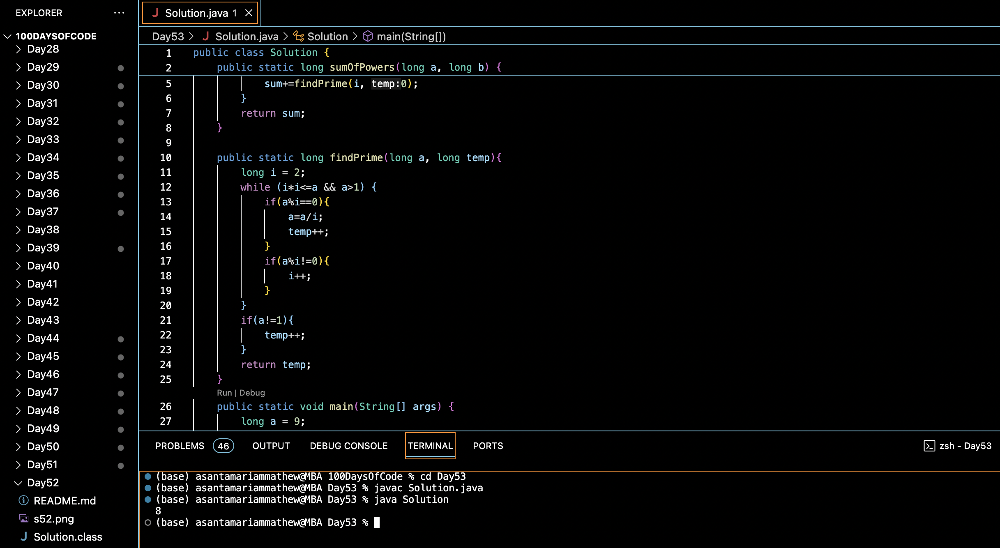

# TECHFEST AND THE QUEUE :blush:
## DAY :five: :three: -January 6, 2024

## Code Overview

This Java program calculates the sum of the number of prime factors for each number in a given range.

## Key Features

- `sumOfPowers(a, b)`: Calculates the sum of the number of prime factors for each number in the range [a, b].
- `findPrime(a, temp)`: Finds the number of prime factors for a given number `a`.
- `main(String[] args)`: Entry point of the program where the range [a, b] is defined and `sumOfPowers` is called.

## Code breakdown

- `sumOfPowers(a, b)`: 
  - Initializes a variable `sum` to store the total sum.
  - Iterates through the range [a, b] and calculates the sum of prime factors for each number using the `findPrime` function.
  - Returns the total sum.

- `findPrime(a, temp)`: 
  - Initializes a variable `i` to 2 and iterates while `i*i <= a` and `a > 1`.
  - Checks if `a` is divisible by `i`, if yes, divides `a` by `i` and increments `temp`.
  - If not divisible, increments `i`.
  - If `a` is not 1 after the loop, increments `temp` (handles the case when `a` itself is a prime number).
  - Returns the count of prime factors (`temp`).

- `main(String[] args)`:
  - Defines the range [a, b].
  - Calls `sumOfPowers` to calculate the result.
  - Prints the result.

## Usage

1. Define the range [a, b] by assigning appropriate values to variables `a` and `b`.
2. Call the `sumOfPowers` method, passing the defined range as arguments.
3. Capture the result returned by the `sumOfPowers` method.
4. Utilize the result as needed.

## Output

## Link
<https://auth.geeksforgeeks.org/user/asantamarptz2>
