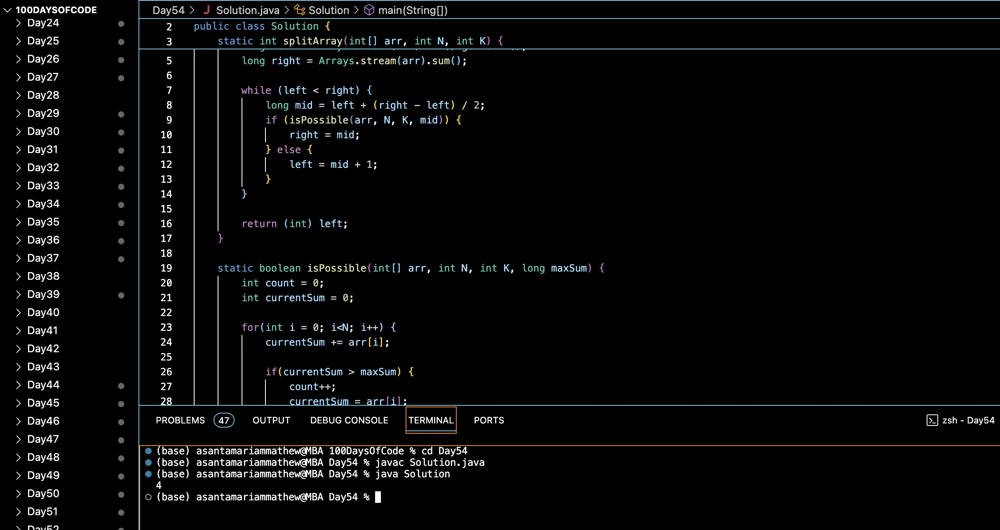

# SPLIT ARRAY LARGEST SUM :blush:
## DAY :five: :four: -January 7, 2024

## Code Overview

This Java program implements a solution to split an array into K subarrays such that the sum of each subarray is as close as possible. The algorithm uses binary search to find the minimum possible sum of subarrays.

## Key Features

- `splitArray(int[] arr, int N, int K)`: Finds the minimum possible sum of subarrays by performing binary search on the range of possible sums.
- `isPossible(int[] arr, int N, int K, long maxSum)`: Determines if it's possible to split the array into K subarrays such that the sum of each subarray does not exceed `maxSum`.
- `main(String[] args)`: Entry point of the program where the array, number of elements, and the number of subarrays are defined and `splitArray` method is called.

## Code breakdown

- `splitArray(int[] arr, int N, int K)`: 
  - Initializes `left` and `right` bounds for binary search based on the maximum element and the sum of all elements in the array, respectively.
  - Performs binary search to find the minimum possible sum that satisfies the splitting condition.

- `isPossible(int[] arr, int N, int K, long maxSum)`: 
  - Iterates through the array, accumulating the sum of elements in each subarray.
  - Increments `count` whenever a subarray sum exceeds `maxSum`.
  - Returns `true` if the number of subarrays (`count`) is less than or equal to `K`.

- `main(String[] args)`: 
  - Defines the array, number of elements (`N`), and the number of subarrays (`K`).
  - Calls `splitArray` method to find the minimum possible sum.
  - Prints the result.

## Usage

1. Define the array `arr`, number of elements `N`, and the number of subarrays `K`.
2. Call the `splitArray` method, passing the array, `N`, and `K`.
3. Capture the result returned by the `splitArray` method.
4. Utilize the result as needed.

## Output

## Link
<https://auth.geeksforgeeks.org/user/asantamarptz2>