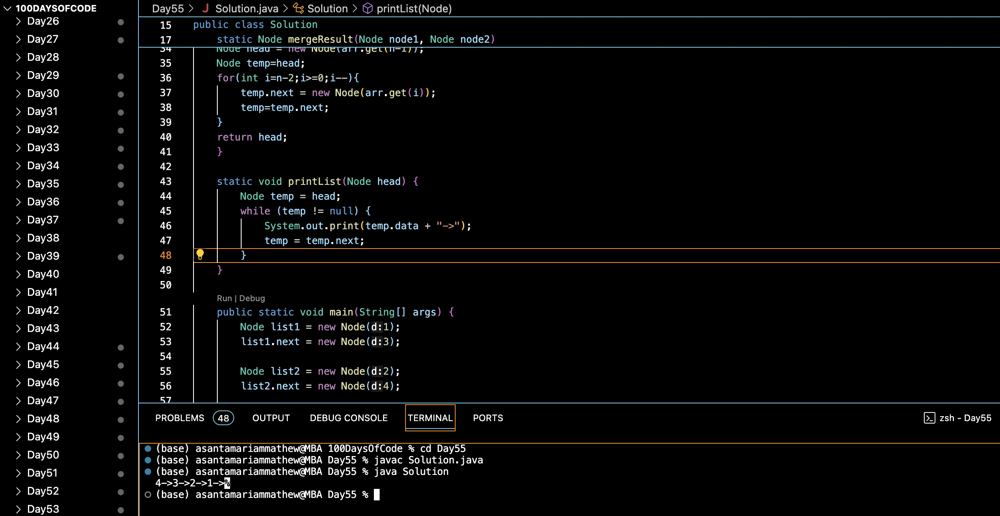

# MERGE TWO SORTED LINKED LISTS IN REVERSE ORDER :blush:
## DAY :five: :five: -January 8, 2024

## Code Overview

This Java program implements a solution to merge two linked lists into a single sorted linked list.

## Key Features

- `mergeResult(Node node1, Node node2)`: Merges two linked lists `node1` and `node2` into a single sorted linked list.
- `printList(Node head)`: Utility method to print the elements of a linked list.
- `main(String[] args)`: Entry point of the program where two linked lists are defined, merged, and the result is printed.

## Code breakdown

- `mergeResult(Node node1, Node node2)`: 
  - Checks if both input linked lists are empty. If so, returns null.
  - Creates an ArrayList to store the elements of both linked lists.
  - Traverses both input linked lists, adding their elements to the ArrayList.
  - Sorts the ArrayList to obtain elements in ascending order.
  - Constructs a new linked list with the sorted elements.
  - Returns the head of the merged linked list.

- `printList(Node head)`: 
  - Traverses the linked list starting from the given head and prints each node's data followed by "->".
  - Stops when it reaches the end of the linked list.

- `main(String[] args)`: 
  - Defines two linked lists `list1` and `list2` with initial elements.
  - Calls `mergeResult` to merge the two lists into a sorted linked list.
  - Prints the elements of the merged linked list using `printList`.

## Usage

1. Define the elements of two linked lists (`list1` and `list2`) and their connections.
2. Call the `mergeResult` method, passing the two linked lists as arguments.
3. Capture the result returned by the `mergeResult` method.
4. Print the merged linked list using the `printList` method.

## Output

## Link
<https://auth.geeksforgeeks.org/user/asantamarptz2>
