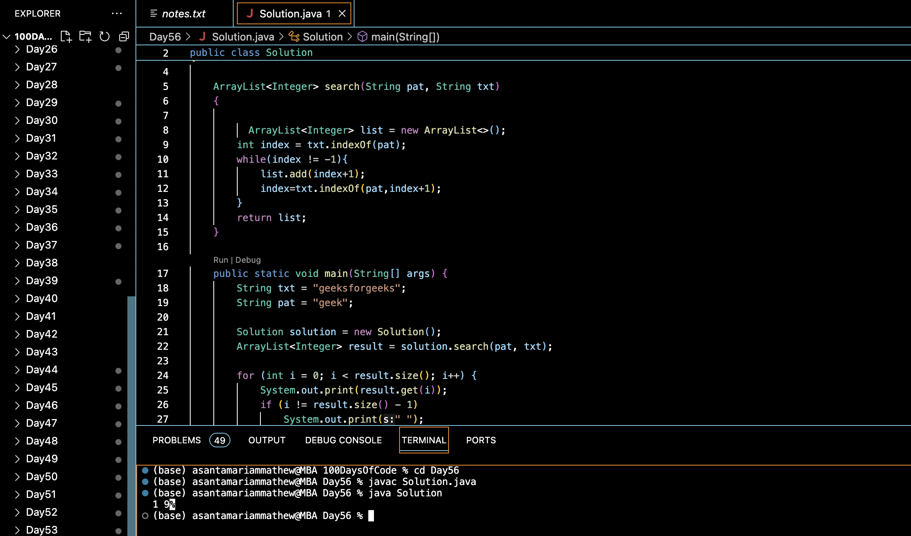

# SEARCH PATTERN (KMP-ALGORITHM) :blush:
## DAY :five: :six: -January 9, 2024

## Code Overview
This Java program implements a string pattern search algorithm. It takes a pattern (`pat`) and a text (`txt`) as input, and it finds all occurrences of the pattern within the text.

## Key Features
- Efficiently searches for occurrences of a pattern within a text.
- Returns the indices of all occurrences of the pattern in the text.

## Code Breakdown
The program consists of:
1. `search` method: This method takes two strings, `pat` (the pattern) and `txt` (the text), and returns an ArrayList containing the indices of all occurrences of the pattern in the text.
2. `main` method: The main entry point of the program. It initializes the text and pattern strings, calls the `search` method, and prints the indices of pattern occurrences in the text.

## Usage
To use this program:
1. Compile the Java file.
2. Run the compiled Java class.
3. The program will prompt you to input the text and pattern.
4. It will then output the indices of pattern occurrences in the text.

## Output

## Link
<https://auth.geeksforgeeks.org/user/asantamarptz2>