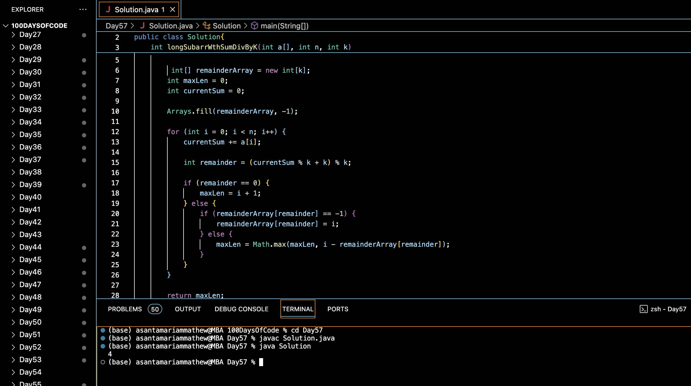

# LONGEST SUBARRAY WITH SUM DIVISIBLE BY K :blush:
## DAY :five: :seven: -January 10, 2024

## Code Overview
This Java program finds the length of the longest subarray in an array where the sum of the elements is divisible by a given integer `k`.

## Key Features
- Efficiently finds the length of the longest subarray with a sum divisible by `k`.
- Utilizes an array to store remainders of cumulative sums, optimizing the process.
- Handles both positive and negative integers in the array.

## Code Breakdown
The program consists of:
1. `longSubarrWthSumDivByK` method: This method takes an array `a[]`, its length `n`, and an integer `k` as input. It computes the length of the longest subarray whose sum is divisible by `k` and returns that length.
2. `main` method: The main entry point of the program. It initializes an array `arr[]`, its length `N`, and the integer `K`, calls the `longSubarrWthSumDivByK` method, and prints the length of the longest subarray with a sum divisible by `k`.

## Usage
To use this program:
1. Compile the Java file.
2. Run the compiled Java class.
3. The program will output the length of the longest subarray in the given array `arr[]` where the sum of elements is divisible by `K`.

## Output

## Link
<https://auth.geeksforgeeks.org/user/asantamarptz2>
