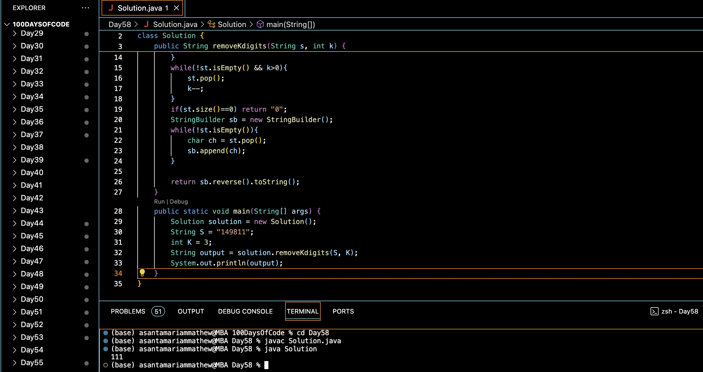

# REMOVE K DIGITS :blush:
## DAY :five: :eight: -January 11, 2024

## Code Overview
This Java program implements a solution to remove `k` digits from a given number `s` to form the smallest possible number. It utilizes a stack data structure to efficiently process and remove digits while maintaining the order.

## Key Features
- Efficiently removes `k` digits to form the smallest possible number.
- Utilizes a stack to process digits and maintain their order.
- Handles cases where removing leading zeros is necessary.
- Handles cases where removing digits from the middle or end of the number is required.

## Code Breakdown
The program consists of:
1. `removeKdigits` method: This method takes a string `s` representing the number and an integer `k` representing the number of digits to remove. It removes `k` digits from the number to form the smallest possible number and returns it as a string.
2. `main` method: The main entry point of the program. It initializes the string `S` and the integer `K`, calls the `removeKdigits` method, and prints the resulting number.

## Usage
To use this program:
1. Compile the Java file.
2. Run the compiled Java class.
3. The program will output the smallest number possible after removing `K` digits from the given number `S`.

## Output

## Link
<https://auth.geeksforgeeks.org/user/asantamarptz2>
